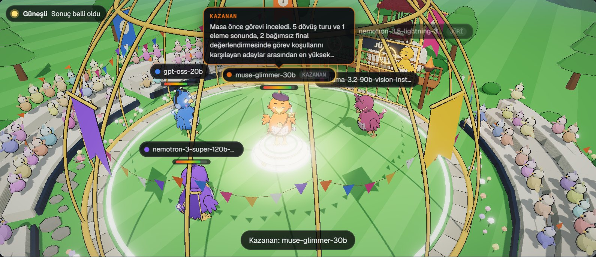
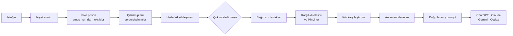
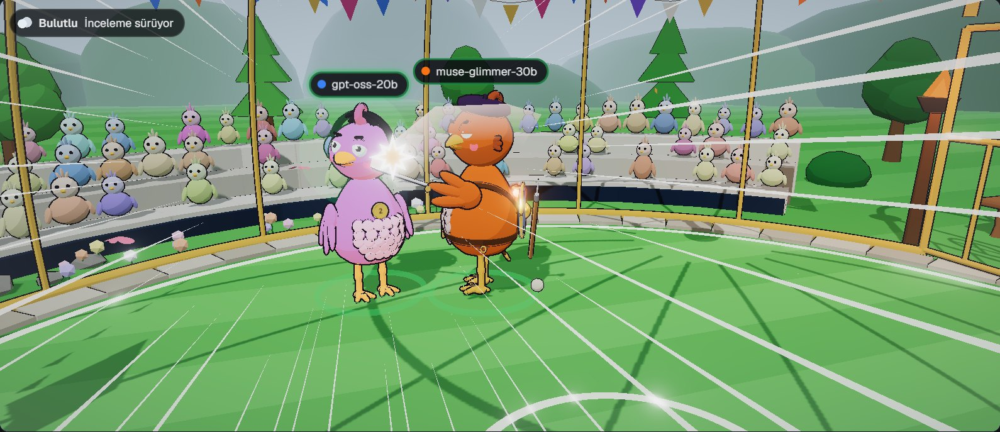
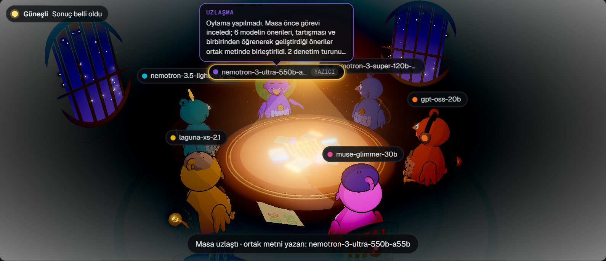
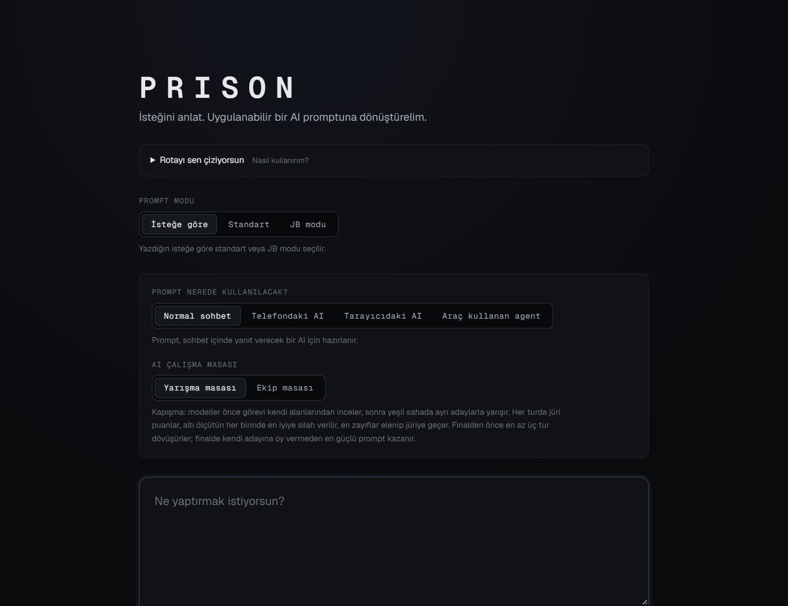
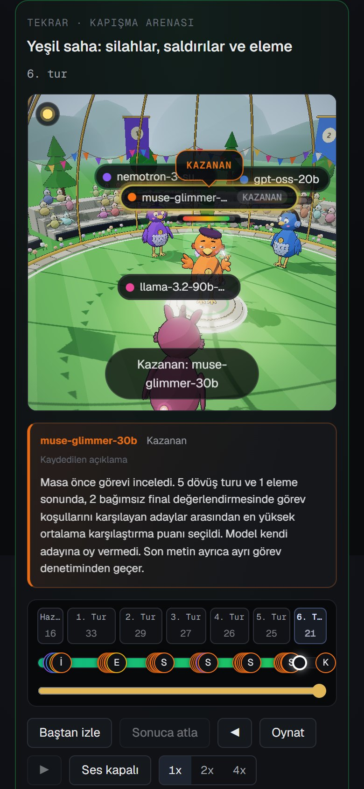

# PRISON

**İsteğini anlat; PRISON onu kullanacağın yapay zekâya göre hazırlanmış, denetlenmiş bir prompta dönüştürsün.**
<br><sub>Open-source prompt studio · [English summary](#in-english)</sub>


Doğal dilde yazılan bir isteği anlayan, onu izole bir **Prison Instance** içine alan,
yapılandırılmış göreve dönüştüren ve hedef yapay zekâ (GPT, Claude, Gemini, Codex) için
optimize edilmiş prompt derleyen uygulama.



Modeller isteğin üzerinde gerçekten çalışırken sahnede izlenir. Her model kendi Pırpır'ıyla temsil edilir.
Kapışma arenasında öneriler yarışır, jüri puanları silahlara dönüşür, en güçlü prompt kazanır.
Ekip masasında ise modeller tek bir ortak metinde uzlaşır. Sahnede görülen her an kayıttaki gerçek bir olaydan gelir.

## İçindekiler

- [Ne işe yarar?](#ne-işe-yarar)
- [Nasıl kullanılır?](#nasıl-kullanılır)
- [Promptu nerede kullanırım?](#promptu-nerede-kullanırım)
- [Nasıl çalışır?](#nasıl-çalışır)
- [Görüntüler](#görüntüler)
- [In English](#in-english)
- [Çalıştırma](#çalıştırma) · [Çok modelli AI masası](#çok-modelli-ai-masası) · [Mimari](#mimari) · [API](#api)

## Ne işe yarar?

- **Ne istediğini netleştirir.** İsteğindeki asıl amacı, değişmemesi gereken sınırları, çıktının biçimini ve
  eksik bilgileri ayırır; bilinmeyenleri uydurmaz, sana sorar.
- **Kullanacağın yapay zekâya göre yazar.** Prompt ChatGPT, Claude, Gemini ya da Codex için; sohbet, telefon,
  tarayıcı ya da araç kullanan agent ortamına göre ayrı ayrı hazırlanır.
- **Birden çok model birlikte çalışır.** İstersen 3–6 farklı model ayrı ayrı taslak yazar, birbirini eleştirir,
  kör karşılaştırılır; son metin anlamsal denetimden geçmeden hazır sayılmaz.
- **Çalışmayı izletir.** Arena ya da ekip masası, modellerin ne önerdiğini, neyi neden değiştirdiğini ve kimin
  kazandığını gösterir.
- **Kontrol sende.** Görevi kendi cümlelerinle düzeltebilir, soruları yanıtlayabilir, sınırları kilitleyebilir,
  eski sürümlere dönebilir ve kendi API bağlantılarını ve modellerini seçebilirsin.

## Nasıl kullanılır?

1. **İsteğini yaz.** "Ne yaptırmak istiyorsun?" alanına derdini kendi cümlelerinle anlat.
2. **Promptun nerede kullanılacağını seç:** Normal sohbet, Telefondaki AI, Tarayıcıdaki AI ya da Araç kullanan agent.
   Prompt modu olarak "İsteğe göre", "Standart" ya da "JB modu"nu seçebilirsin.
3. **Çalışma masasını seç:** Yarışma masasında modeller ayrı adaylarla yarışır; ekip masasında tek bir ortak metinde uzlaşır.
4. **Planı ve soruları gözden geçir.** Eksik bilgi sorularını yanıtla; gerekirse görevi kendi cümlelerinle düzelt.
5. **Masayı izle.** Öneriler, eleştiriler ve kararlar sahnede ve konuşma dökümünde görünür.
6. **Promptu al ve kullan.** Hazır metni kopyala ve hedef yapay zekâya yapıştır. Sonuç istediğin gibi olmazsa geri
   bildirim ver; PRISON yeni bir sürüm üretir.

## Promptu nerede kullanırım?

| Seçtiğin kullanım yeri | Promptu yapıştıracağın yer | En uygun işler |
| --- | --- | --- |
| Normal sohbet | ChatGPT, Claude ya da Gemini'nin web veya masaüstü sohbeti | Metin, plan, analiz, öğrenme, tek seferlik işler |
| Telefondaki AI | Aynı asistanların mobil uygulamaları | Kısa, adım adım ilerleyen yanıtlar |
| Tarayıcıdaki AI | Tarayıcıda sayfaları okuyup işlem yapabilen asistanlar | Web'de araştırma, form ve sayfa işleri |
| Araç kullanan agent | Codex gibi kod ve dosyalar üzerinde çalışan agent'lar | Proje içinde dosya düzenleme, komut çalıştırma, test |

Hedef yapay zekâyı "otomatik" bırakırsan PRISON işin türüne göre en uygununu önerir ve nedenini gösterir.

## Nasıl çalışır?



```
KULLANICI İSTEĞİ → INTENT ENGINE → PRISON OLUŞTURUCU → İZOLE PRISON STATE
→ ÇÖZÜM PLANI + GEREKSİNİMLER → HEDEF AI SÖZLEŞMESİ → ÇOK MODELLİ AI MASASI
→ BAĞIMSIZ ADAYLAR → KARŞILIKLI ELEŞTİRİ → İKİNCİ TUR → KÖR KARŞILAŞTIRMA
→ SON METNİN ANLAMSAL DENETİMİ → GEREKİRSE BİR DÜZELTME → DOĞRULANMIŞ PROMPT
```

## Görüntüler

| Saldırı anı | Ekip masası |
| --- | --- |
|  |  |

| Başlangıç | Telefonda |
| --- | --- |
|  |  |

## In English

**PRISON is an open-source prompt studio.** You describe what you want in plain language; PRISON isolates the
request in its own structured task (a "prison"), works out the goal, constraints, missing context and output
format, and compiles a verified, ready-to-use prompt for the AI you will paste it into: ChatGPT/GPT, Claude,
Gemini, Codex or a tool-using agent, in a phone, browser or chat setting.

- **Request → structured task → prompt.** An intent engine reads the request, a requirement resolver turns it into a
  task spec, and a prompt compiler builds the prompt block by block for the chosen target AI.
- **A council of models.** Optionally, 3–6 different LLMs draft candidate prompts independently, critique each
  other, revise, and are judged blind; the final text passes a semantic check before it is offered.
- **Watch the work.** The council runs as a 3D scene: a competition arena, where the jury's scores become weapons
  and the strongest prompt wins, or a team table, where the models converge on one shared text. Every moment on
  stage comes from a real recorded event.
- **You stay in control.** Revise the task in plain language, answer clarifying questions, pin constraints that must
  never change, switch the target AI, restore earlier versions, and choose your own API connections and models.
- **Providers:** NVIDIA, DeepSeek, Anthropic and OpenAI (keys stay on the server); a local engine works without any
  key. Prompts can be produced in Turkish or English; the interface is in Turkish.
- **Stack:** Next.js 16, React 19, TypeScript, Zod, three.js, Vitest.

```bash
npm install
cp .env.example .env.local   # optional: add one provider key
npm run dev                  # http://localhost:3100
```

## Çalıştırma

```bash
npm install
npm run dev        # http://localhost:3100
```

AI sağlayıcısı: `.env.example` dosyasını `.env.local` olarak kopyala ve bir anahtar gir.
Anahtarlar yalnızca sunucuda kullanılır; `NEXT_PUBLIC_` öneki ekleme ve `.env.local` dosyasını paylaşma.
Ortam ayarlarını değiştirdiğinde geliştirme sunucusunu yeniden başlat.

| Değişken | Açıklama |
| --- | --- |
| `NVIDIA_API_KEY` | NVIDIA motoru (varsayılan model `nvidia/nemotron-3.5-lightning-30b-a3b`) |
| `DEEPSEEK_API_KEY` | Resmî DeepSeek motoru (varsayılan model `deepseek-flash`) |
| `ANTHROPIC_API_KEY` | Claude motoru (varsayılan model `claude-opus-5-5`) |
| `OPENAI_API_KEY` | OpenAI motoru (varsayılan model `gpt-5.5`) |
| `PRISON_PROVIDER` | `nvidia` \| `deepseek` \| `anthropic` \| `openai` \| `local` — seçimi zorlar |
| `PRISON_MODEL` | Model adını değiştirir |
| `NVIDIA_BASE_URL` | NVIDIA API adresi (varsayılan `https://integrate.api.nvidia.com/v1`) |
| `DEEPSEEK_BASE_URL` | DeepSeek API adresi (varsayılan `https://api.deepseek.com/v1`) |
| `PRISON_DATA_DIR` | Prison kayıtlarının klasörü (varsayılan `data/prisons`) |
| `PRISON_COUNCIL_MODE` | `enabled` çok modelli masayı açar; varsayılan `off` |
| `PRISON_COUNCIL_MODELS` | Virgülle ayrılmış 3–6 farklı NVIDIA API model kimliği |
| `PRISON_COUNCIL_RESERVE_MODELS` | En fazla 6 yedek model; ön kontrolde düşen üyenin yerine geçer. `none` ön kontrolü kapatır |
| `PRISON_COUNCIL_DEPTH` | `deep` (varsayılan): inceleme turu, en az 3 dövüş turu, masada öğrenme ve en az 2 onay turu. `quick`: kısa akış, kapışmada 1–2 tur |

Otomatik seçim önceliği **NVIDIA → DeepSeek → Anthropic → OpenAI** şeklindedir.
Zorlanan sağlayıcının anahtarı eksikse veya sağlayıcı adı geçersizse anlaşılır bir yapılandırma hatası gösterilir.
Önceki sürümde `DEEPSEEK_API_KEY`/`PRISON_PROVIDER=deepseek` ile kullanılan NVIDIA model ayarları desteklenir;
yeni kurulumlarda `NVIDIA_API_KEY` ve `PRISON_PROVIDER=nvidia` kullan.

Anahtar yoksa uygulama **yerel kural tabanlı motorla** çalışır ve arayüzde bunu açıkça belirtir.
Yerel motor tüm akışı (analiz, derleme, revizyon, sürümler) uçtan uca çalıştırır ama anlamsal
analiz için bir AI sağlayıcısı gerekir.

NVIDIA ve DeepSeek çağrıları gerçek çıktı şemasını modele iletir ve JSON yanıt ister.
Yanıtlar yerelde doğrulanır; kesilmiş yanıtlar ve sağlayıcı reddi ayrı hata olarak işlenir.
Çağrıların zaman aşımı ve yeniden deneme sayısı sınırlıdır.
NVIDIA yalnızca tamamlanmış HTTP 429/503 yanıtlarında 500 ms sonra bir kez daha
denenir; iki çağrı aynı, en fazla 180 saniyelik süreyi paylaşır. Masa adımları daha kısa
bir bütçe verebilir. Zaman aşımı veya genel ağ hatası
otomatik tekrarlanmaz. Kesilen Ultra yanıtında düzeltme çağrısı gerçek token bütçesini
8000'den 16000'e yükseltir; NVIDIA için artırma üst sınırı 32768'dir.
Nemotron 3.5 Lightning için JSON üretiminde `chat_template_kwargs.enable_thinking=false`
gönderilir; planlama, üretim ve son metin değerlendirmesi uygulamanın ayrı adımlarıdır.
Bu ayar, [NVIDIA'nın yapılandırılmış çıktı yönergesini](https://docs.nvidia.com/nim/large-language-models/2.0.10/get-started/advanced/get-started-nemotron-3.5-lightning.html)
izler ve yanıt bütçesinin uzun bir iç iz yerine JSON sonucuna ayrılmasını sağlar.

`nvidia/nemotron-3-ultra-550b-a55b` seçildiğinde Ultra çağrıları
`reasoning_effort=medium`, `enable_thinking=true`, `medium_effort=true`, `temperature=1`,
`top_p=0.95` ve en az 8000 token bütçesi kullanır. Bu modele özgü ayarlar diğer
sağlayıcılara taşınmaz. [NVIDIA Ultra API belgesi](https://docs.api.nvidia.com/nim/reference/nvidia-nemotron-3-ultra-550b-a55b-infer)
parametreleri açıklar; bu kurulumdaki hosted uç nokta kabul etmediği için
`reasoning_budget` gönderilmez. Daha büyük modelde analiz ve denetim daha uzun sürebilir;
başarısız veya geçersiz yanıtlar geçerli bir sonuç gibi kaydedilmez.
Ultra yanıtı parça parça alınır; yalnızca son içerik parçaları birleştirilir, iç düşünce
izi arayüze veya görev kaydına aktarılmaz. Başarılı bitiş işareti, tam JSON ve şema
doğrulaması gerekir. Bağlantı ve bütün yanıt akışı aynı 180 saniyelik sınırı paylaşır;
yarım metin başarı sayılmaz. Zaman aşımı bağlantı hatasından ayrı açıklanır.

Super için `medium` yerine desteklenen `low` akıl yürütme, yüksek çaba isteyen adımlarda
`high` kullanılır; kendi düşünme şablonu ve NVIDIA'nın önerdiği örnekleme ayarları gönderilir.
[Super model kartı](https://build.nvidia.com/nvidia/nemotron-3-super-120b-a12b/modelcard)
bu kontrolleri açıklar. GPT-OSS çağrıları ayrı çaba ve örnekleme ayarlarıyla akar;
20B için gönderilen çıktı bütçesi hosted API'nin 4096 token sınırını aşmaz.
[GPT-OSS 20B API belgesi](https://docs.api.nvidia.com/nim/reference/openai-gpt-oss-20b-infer)
bu sınırı ve geçerli çaba seçeneklerini belirtir.

Claude motorunda structured outputs (`output_config.format`) kullanılır. Çağrı seçilen modelle
yapılır; ret yanıtı anlaşılır hata olarak gösterilir, başka modele örtük yönlendirme yapılmaz.

Diğer komutlar: `npm test` (vitest), `npm run typecheck`, `npm run build`.

### Çok modelli AI masası

Tek NVIDIA anahtarıyla farklı model uç noktalarına gerçek çağrı yapılır; aynı modelin
altı kişiliğe bölünmesi altı farklı model sayılmaz. Bu kurulumda masa açıktır.

Varsayılan masa (4 Ekim 2026 canlı testine göre): `nvidia/nemotron-3-ultra-550b-a55b`,
`nvidia/nemotron-3-super-120b-a12b`, `openai/gpt-oss-20b`, `meta/muse-glimmer-30b`,
`meta/llama-3.2-90b-vision-instruct`, `nvidia/nemotron-3.5-lightning-30b-a3b`.
Bu bilgisayardaki son bağlantı testlerinde Ultra ve Llama yanıt vermediğinden yerel ayar
ana motor olarak Super'ı kullanır; masada Ultra yerine `poolside/laguna-xs-2.1`, Llama
yerine `nvidia/nemotron-3-nano-omni-30b-a3b-reasoning` bulunur. Diğer dört koltuğun
uzmanlıkları korunur. Ultra ve Llama yalnız ön kontrolü geçerlerse yedek olarak alınır.
Aynı testte GLM-5.3, DeepSeek v4.1 Flash, Kimi K3 ve Gemma 4 sürekli zaman aşımına düştü.
Katalogdaki birçok model de bu hesapta 404 döndü. Model erişimi zamanla değişir:
`npm run council:check` masadaki modelleri, `npm run council:check -- --catalog` ise
anahtarın listelediği tüm modelleri dener. Anahtar ekrana yazılmaz. Yapılandırılmış
model sayısı, o anda hepsinin başarıyla yanıt verdiği anlamına gelmez. Başarılı bir sürümün
masa kaydı hangi modellerin tamamlandığını, hangilerinin hata verdiğini ayrı gösterir.

Standart ve JB promptları aynı denetimli masadan geçer. Kullanıcı normal sohbet, telefon,
tarayıcı veya araç kullanan agent ortamını seçer; bu seçim hesap erişimi veya yeni yetki
vermez. Agent seçimi eski Agent Modu düğmesiyle birlikte güncellenir. Her iki yöntemde de
görev koşulları ortak ve bağlayıcıdır; çoğunluk görüşü kullanıcı sınırlarını aşamaz.

**Ön kontrol ve yedekler.** Masa başlamadan her model en fazla 20 saniyelik küçük bir JSON
testinden geçer. Yanıt vermeyenin yerine `PRISON_COUNCIL_RESERVE_MODELS` listesindeki ilk
çalışan yedek aynı koltuk ve uzmanlıkla oturur (varsayılan yedekler kodda; `none` kapatır).
Değişiklikler sonuç panelinde gösterilir.

**Derinlik.** `PRISON_COUNCIL_DEPTH=deep` varsayılandır. Bu ayarda:

- Kimse yazmadan önce her model görevi kendi uzmanlık alanından inceler. Bulgular, riskler,
  açık sorular ve yaklaşım masaya paylaşılır; herkes önerisini bu notlardan öğrenerek yazar.
  Bu bir internet araştırması değildir: modeller yalnızca görev durumunu ve sözleşmeyi inceler.
- Kapışmada finalden önce en az 3 dövüş turu yapılır. Jüri hâlâ orta veya yüksek önemde sorun
  bildiriyorsa ya da en iyi puan yükselmeye devam ediyorsa 5 tura kadar sürer.
- Masada üyeler tartışmadan sonra kendi önerilerini birbirlerinden öğrenerek geliştirir.
  Ortak metin, herkes onaylasa bile en az 2 tur denetlenir. Orta düzey sorun kaldıkça en fazla
  4 tura kadar cilalanır. Sonraki bir cilalama onayı kaybederse son onaylanan metin korunur.

`quick` kısa akışı kullanır; beş veya altı adayın üç finaliste inmesi iki eleme turu gerektirir.
Değerlendirme çağrıları başarısız olsa da tur üst sınırı aşılmaz. Sınırda üçten fazla aday
kalırsa kalanlar son bağımsız değerlendirmeye girer; yeterli kanıt yoksa kazanan kaydedilmez.
Derin modun süresi sağlayıcı yanıtlarına bağlıdır; canlı denemelerde 25 dakikayı, yoğun uç
noktalarda 50 dakikayı aşan akışlar görüldü. Geçen süre tek başına işi sonlandırmaz.

**Yarışma masası = kapışma arenası.**

İzleme sahnesinde tribün kuşlarının dört siluet ailesi ve beş tepki biçimi vardır; aynı
seyirci hareketi arka arkaya tekrarlanmaz. Tepkiler gerçek sahne olaylarına bağlıdır.
Kaydedilen konuşma alıntıları sahnenin altında okunur; telefonda karakterleri kapatmaz.
"Okuma temposu" uzun açıklamalara daha fazla süre ayırır, klavyeyle kullanılabilen
çizelge herhangi bir gerçek ana atlamayı sağlar. Jüri değerlendirmesi puan olarak gösterilir.
Tekrar gelen aynı sunucu bilgisi hareketi ve izleme süresini sıfırlamaz; kayıt sonunda
oynatma durur. Hareket azaltma tercihi korunur.

1. Modeller bağımsız adaylar üretir.
2. Jüri (aday üreten tüm modeller, elenenler dahil) kendi adayı hariç her adayı altı ölçütte
   puanlar ve eleştirir. Her ölçütte o turun en iyisi bir "silah" kazanır: kılıç (amaç uyumu),
   yay (bağlam), kalkan (sınırlar), çekiç (uygulama), mızrak (çıktı), asa (hedef AI uyumu).
3. Üçten fazla aday varsa en düşük ortalamalılar elenir ve jüri sırasına geçer
   (6 → 4 → 3). Kalanlar eleştirilerle adaylarını güçlendirir.
4. Üç finalist model adları gösterilmeden oylanır; kimse kendi adayına oy veremez.
   Bir adayın kazanabilmesi için oyların en az üçte ikisi tam onay (her ölçütte en az 0.75)
   olmalı ve en fazla bir jüri üyesi yüksek önemde sorun bildirmiş olmalıdır.

**Ekip masası = karanlık oda, oylama yok.** Modeller öneri üretir, birbirlerinin önerilerini
kendi uzmanlık alanından tartışır. Bir yazıcı model tüm önerileri ve tartışmayı ortak metinde
birleştirir. Masa, diğer üyelerin hepsi temiz onay verene kadar metni birlikte düzeltir. Son turda
oybirliği yoksa en son geniş uzlaşma sağlanan metin kullanılır: üyelerin en az üçte ikisi tam
onay vermiş olmalı ve yüksek önemde itiraza ikinci bir üye katılmamış olmalıdır. Tek başına kalan
ciddi çekince her turda tartışılır ve karara yazılır, ama veto sayılmaz. Canlı denemelerde tek bir
küçük modelin her turda çelişkili "yüksek" itirazlar tekrarlayıp masayı kilitlediği görüldü.
Tur sınırında uzlaşma çıkmazsa veya ortak metin yazma çağrıları tamamlanamazsa gerçek adaylar
çöpe atılmaz: en az üç aday ve iki bağımsız
değerlendirmenin kanıtı varsa eldeki en güçlü metin son denetime gönderilir. Karar kaydı
uzlaşma olmadığını, itirazları ve yanıt vermeyen üyeleri açıkça belirtir. Aynı aktarım kapışma
arenasında da geçerlidir; seçim, masa onayı veya oybirliği gibi gösterilmez. Yeterli gerçek
aday/değerlendirme yoksa üretim hata verir. Her durumda bağımsız son denetçi ve kullanıcı
sınırları için kural kontrolleri geçmeden yeni prompt kaydedilmez.

Yapılandırılmış konsey başlamadan önce görev sözleşmesi gerçek kullanıcı talimatlarıyla
denetlenir. Türetilmiş bir koşul veya plan çelişirse yalnızca güvenli düzeltmeler uygulanır,
gerekirse plan yenilenir ve sözleşme bir kez daha denetlenir. Sorun sürerse masa başlamaz.
Kaynak denetimi ve son metin denetimi ayrı ayrı en fazla bir onarım yapabilir.

Her iki yöntemde seçilen tam metin ayrıca bağımsız bir modelle görev/kaynak denetiminden geçer.
Denetim metni reddederse masa baştan kurulmaz: seçilen metin bulgularla bir kez düzeltilir
ve yeniden bağımsız denetlenir. Seçilen model düzeltme çağrısında yanıt veremezse başka bir
gerçek jüri üyesi yazmayı devralabilir; kendisini değerlendiremez. Bağımsız denetçi
kalmıyorsa metin kaydedilmez. Derin modun 150 saniyelik çağrı bütçesi son düzeltmede de
korunur. İlk seçim, düzeltmeyi yazan model ve son denetçi sonuçta ayrı belirtilir.
Sonuç ancak bu kontrol de geçerse kaydedilir.
Son denetimi yapan model geçici olarak yanıt veremezse, metni onaylayan diğer jüri üyeleri
sırayla devralır. Düzeltme için plan yenilemek gerekip ana motor geçici olarak aşırı yüklüyse,
planı masa üyeleri yeniler. Her iki durumda da iş yine bir yapay zekâ çağrısıyla yapılır.
Amaç uyumu veya sınır netliğinde ciddi bir bulgu ya da yetersiz puan varsa, mevcut çözüm planı da bir kez yenilenir; yeni görev sözleşmesiyle üretilen tam metin yeniden denetlenir.
Son denetçi kaydı gerçekten yanıt veren modele güncellenir. Denetimini tamamlayamayan
üyeler onay vermiş sayılmaz ve eksik yanıtlar karar metninde belirtilir.

Jüri çağrılarında yalnızca geçici ağ, yoğunluk ve zaman aşımı hatalarına bir ek deneme
verilir. Kimlik doğrulama/yapılandırma hatası veren jüri aynı oturumda tekrar çağrılmaz;
yokluğu kayda geçer. Son metin denetiminde başka gerçek bağımsız jüri devralabilir.
Geçersiz yapılandırılmış yanıtın kendi düzeltme denemesi dışında aynı tur tekrar edilmez;
yeni metnin sonraki turu yeniden değerlendirilebilir.

Uzlaşmasız seçim, sahnede **son denetime seçilen aday** olarak gösterilir; uzlaşma veya
zafer canlandırması yapılmaz. Son kontrolü geçen kayıtlı promptta seçimin dayanağı ayrıca
korunur. Önceki kayıtlar yeni alanlar olmadan okunmaya devam eder.

Derleme, hedef/modifier değişimi ve revizyon HTTP 202 ile hemen kabul edilir; uzun AI çalışması
tarayıcı bağlantısından bağımsız bir yerel sunucu işi olarak sürer. İş durumu ve son tartışma
`data/prisons/.operations` altında tutulur (`PRISON_DATA_DIR` değişirse o dizinin altında).
Tarayıcı toplam üretim süresine sınır koymaz; kısa durum okuması zaman aşımına uğrarsa aynı
işi tekrar takip eder, ikinci bir üretim başlatmaz. Sayfa yenilenince seçili görevin işi tekrar
bulunur; bitince yeni prompt otomatik yüklenir. Hata olursa tartışma, açık hata nedeni ve yeniden
deneme düğmesi görünür kalır; önceki geçerli prompt korunur.

Yeni iş kayıtları gönderilen üretim ayarlarını, değişikliği, revizyon mesajını veya soru
yanıtlarını da saklar. **Aynı işlemi yeniden dene** bunları sunucuda aynen tekrar kullanır;
eski görev ayarlarıyla farklı bir üretime dönüşmez. Görev veya son işlem değişmişse eski
isteğin tekrarı reddedilir. Önceki iş kayıtlarında bu bilgi bulunmadığından **Promptu
yeniden üret** güncel görev için yeni üretim başlatır.

Masanın seçtiği tam taslak, son denetim başlamadan `data/prisons/.council-checkpoints`
altına özel olarak kaydedilir. Bu taslak onaylanmış bir prompt sürümü değildir ve genel
API'den gösterilmez. Son düzeltme veya denetim bağlantısı kesilirse yeniden deneme kalan
aşamadan devam eder; başarıyla düzeltilmiş metin tekrar yazdırılmaz, yalnızca denetlenir.
Görev, kullanıcı talimatları, ayarlar, etkin sürüm veya model yapılandırması değişmişse
eski taslak kullanılmaz. Düzeltmeden sonra kalite kontrolünü geçemeyen metin için yeni bir
masa kurulur. Yeni prompt kalıcı olarak kaydedildikten sonra özel taslak temizlenir.
Aynı metin revizyonu veya aynı soru-yanıt çifti yeniden denenirken hazırlanmış revizyon
ve gerçek kullanıcı kaydının kimliği korunur; analiz, planlama ve tartışma tekrarlanmaz.
Soru bağlamı, yanıt veya etkin kullanıcı dalı değişirse yeni analiz ve tartışma yapılır.

İlk üretim sürerken durum **Üretiliyor**, mevcut bir prompt yeniden hazırlanırken
**Yeni sürüm hazırlanıyor** görünür. Geçen süre, kaydedilmiş gerçek başlangıçtan hesaplanır;
sayfa yenilemesi veya aşama değişimi sayacı sıfırlamaz. Bu sayaç bitiş tahmini değildir.

Devam eden iş aynı sunucu sürecindeki kod yenilemelerinde kilidini ve ilerlemesini korur.
Sunucu veya bilgisayar kapanırsa devam eden API çağrıları sürmez. Yeniden açılışta eski iş
`interrupted` olarak işaretlenir; son tartışma ve geçerli prompt korunur, kullanıcı yeniden
deneyebilir. Tam taslak seçilip özel olarak saklanmışsa kalan son denetimden devam edilir;
henüz aday seçilmemişse masa yeniden kurulur. Bu iş yürütücüsü yerel Node sunucusu içindir; sunucusuz dağıtımda kalıcı dış iş
kuyruğu gerekir. Aynı görevde ikinci üretim, silme ve sürüme dönüş devam eden işlemi değiştiremez.

**Hafıza.** Yeniden üretme veya revizyon sırasında, görüntülenen sürümün masa sonucu (benimsenen
yön ve açık bulgular) yeni masaya çalışma hafızası olarak verilir. Bu bilgi kullanıcı talimatı
veya izin sayılmaz; mevcut görev ve revizyonlar farklıysa onlar geçerlidir.

**Görsel masa.** Masa çalışırken ve sonrasında 3D sahne (three.js) gösterilir. Ekip masasında
karanlık odada lambanın altında oturan, kapışmada yeşil sahada savaşan renkli robotlar vardır.
Konuşan model yeşil yanar, düşünen model yanıp söner. Baloncuklar modellerin masada paylaştığı
önerilerden, eleştirilerden ve kararlardan alıntıdır; gizli iç düşünce izi kaydedilmez. Kayıtlı
sürümler baştan oynatılabilir, adım adım ilerletilebilir ve konuşma dökümü okunabilir.

En az üç ayrı model gerçek aday üretmeli; seçime dayanak olan aday için en az iki bağımsız
modelin karşılaştırması gerekir. Keşif notu alınamayan üye aday üretmeyi yine deneyebilir;
eksik keşif veya değerlendirme yanıtları başarı sayılmaz.
Üç iş aynı anda yürütülür; bir modelin yapılandırılmış yanıt denemeleri kısa modda ortak
90, derin modda ortak 150 saniyelik bütçeyi paylaşır (yazıcının birleştirme çağrısı
150 saniye). Bozuk JSON dönen bir jüri
değerlendirmesi aynı bütçe içinde bir kez düzeltme ister. Yetersiz katılımda veya geçmeyen son
denetimde mevcut kayıt korunur; yerel bir metin çok modelli başarı gibi sunulmaz. Puanlar model
değerlendirmesidir, doğruluk veya başarı garantisi değildir.

GitHub araştırmasında [Microsoft Agent Framework](https://github.com/microsoft/agent-framework)
ile paralel/ortak çalışma, [ChatEval](https://github.com/thunlp/ChatEval) ile bağımsız
hakemlik ve [Multiagent Debate](https://github.com/composable-models/llm_multiagent_debate)
ile sınırlı turda karşılıklı düzeltme yaklaşımları incelendi. Bu akış mevcut TypeScript
uygulamasında uygulanmıştır. Dış projelerden bir çalışma zamanı kurulmadı; yalnızca görsel
sahne için `three` paketi eklendi ve yalnızca sahne açıldığında tarayıcıda yüklenir.

### İstek ekranı

- **Prompt modu:** “İsteğe göre” seçeneği metindeki mod isteğini yorumlar; “Standart” ve “JB modu”
  seçimleri açık tercih olarak sunucuya gönderilir. JB seçildiğinde giriş alanı kırmızı çerçeveyle gösterilir.
- **Taslak kurtarma:** İstek metni, hedef AI, dil, mod, kullanım ortamı ve masa tercihi bu tarayıcıda otomatik kaydedilir.
  Yenileme sonrası taslak geri gelir; başarılı analizden sonra temizlenir. Başarısız analiz taslağı korur.
- **Bağlantı kontrolü:** Yan menüdeki “Bağlantıyı kontrol et” düğmesi seçili modelden küçük bir JSON
  yanıt isteyerek bağlantıyı doğrular. Sayfa açılışında uzaktan kontrol yapılmaz; eşzamanlı kontroller
  aynı isteği paylaşır. Kontrol sonucu görev kayıtlarını değiştirmez.
- **Çözüm planı:** API analizi isteğin asıl amacını, uygulanacak adımları, her adımın amacını ve
  kontrol ölçütünü çıkarır. Hedef AI tercihi ve gerekçesi görünür; açık kullanıcı seçimi korunur.
- **Eksik bilgiler:** Sonucu değiştiren sorular gösterilir ve ilk prompttan önce yanıtlanabilir.
  İlk turda en önemli üç soru ayrı yanıt alanlarıyla sunulur. Bilinen sorular kısmen de
  yanıtlanabilir; soru bağlamı ve kullanıcı yanıtı ayrı alanlarla gerçek revizyon API'sine
  gönderilir. Sistem sorusu kullanıcı talimatı, izin veya kaynak alıntısı sayılmaz. Başarısız
  işlemde yanıt alanları korunur; başarılı işlemde görev ve çözüm planı yenilenir.
  Modelden yanıtlanmış bilgileri tekrar sormaması ve kalan önemli soruları sonraki turda
  önceliklendirmesi istenir. Serbest metinle görev düzeltme de kullanılabilir.
  Görev değiştiğinde plan güncel gereksinim ve görev hafızasından yeniden hazırlanır.
  Bilinmeyenler gerçekmiş gibi doldurulmaz.
- **Üretim kanıtı:** Standart ve JB sürümleri gerçek üretim kaynağını ve son metni denetleyen
  katmanı gösterir. Bu denetimler prompt içindir; hedef AI'ın işi tamamladığı iddia edilmez.

### Kullanıcının AI ekibi ve katılımı

Yan menüde **AI ekibim · API ayarları** ekranından bağlantı ekleyebilir/çıkarabilir,
analiz modelini ve promptu hazırlayacak 3–6 farklı modeli seçebilirsin. NVIDIA, DeepSeek,
OpenAI, Anthropic ve HTTPS üzerinden OpenAI uyumlu Chat Completions API desteklenir.
Model kimlikleri ve uzmanlıkları kullanıcı tarafından belirlenir; sağlayıcı erişimi gerçek
üretim öncesinde sınanır. Kaydetmek uzaktan API çağrısı yapmaz. Kayıtlı ekibe seçilmemiş
yedek model eklenmez; başlamış işlemler kendi bağlantılarıyla tamamlanır.

Anahtarlar sunucuda `PRISON_DATA_DIR/.provider-settings.json` içinde saklanır; bu yerel
dosya şifrelenmez. Anahtarlar tarayıcıya geri gönderilmez veya tarayıcı depolamasına yazılmaz.
Boş anahtar mevcut kaydı korur; **Anahtarı kaldır** açıkça kaldırır. Adres/sağlayıcı değişiminde
yeni anahtar gerekir. İlk kayda kadar ortam ayarları kullanılır; **Başlangıç ekibine dön**
kayıtlı ayarları kaldırarak ortam ayarlarına döner. Ayar değişiklikleri yeni üretimlerde geçerlidir.

**Sahneye katıl** bölümündeki 50 ayrı eklem hareketi bir karaktere seçilerek veya kısa hareket
komutuyla gönderilir. Komut izlemeyi duraklatıp sahneyi görünür alana getirir; arka plandaki
üretimi, jüri puanlarını ve olay kaydını değiştirmez. Oturan karakterler ve eşya taşıyan kanatlar
korunur. Otomatik hareketler karaktere ve gerçek olaya göre çeşitlenir; aynı klip arka arkaya
seçilmez. Silahlar kanat/sırt bağlantılarında taşınır; açık ekipman rehberi her birinin gerçek
jüri ölçütünü ve o andaki sahibini gösterir.

Hedef/sınır/çıktı ipuçları kullanıcının görünür isteğine eklenir. Kapatılabilir **Nasıl kullanırım?**
açıklamaları aşamaya uygun yönlendirme verir. Hazır sürümde tam prompt kopyalanabilir veya
`.txt` indirilebilir; başka AI'a gönderme kullanıcının kontrolündedir. Sonuç geri bildirimi
gerçek revizyon akışına gider; tamamlanmadan başarı mesajı verilmez. Başarısız tartışma kaydı
hazır prompt gibi sunulmaz.

Bu yapının amacı ve genişletme kuralları: [ürün sistemi](docs/product-system.md).

## Mimari

```
src/
  models/              Zod şemaları = tek doğruluk kaynağı (Prison, Spec, Intent, Prompt, Options)
  templates/           Ortak prompt metinleri: ifadeler, blok başlıkları, görev türü profilleri,
                       aile şablonları, motor sistem promptları, UI etiketleri
  core/
    intent-engine/     LLM ile anlamsal analiz (structured output + doğrulama + kontrollü retry);
                       local/ altında anahtarsız yedek analizör
    task-types/        Genişletilebilir görev türü kaydı (switch-case yok)
    prison-engine/     Prison oluşturma, durum makinesi, öğe/ID yönetimi, patch + görev hafızası, modifier'lar
    requirement-resolver/  Intent → normalize Prison Spec; güvenlik ve profil varsayılanları
    context-engine/    İzolasyon sınırı: derleyiciye/LLM'e yalnızca TEK prison'ın state'i verilir
    prompt-compiler/   Blok seçimi → blok inşası → (kısaltma) → adapter → sıralama → render
    prompt-refiner/    Standart prompt için göreve özel API yönlendirmesi; bağlayıcı sözleşme korunur
    jailbreak-engine/ JB için göreve özel çerçeve; tam görev sözleşmesiyle birleştirilir
    prompt-critic/     Kural tabanlı + LLM eleştirmen; düzeltmeler state'e patch olarak uygulanır
    output-validator/  Yapısal doğrulama
    revision-engine/   Serbest metin revizyon → StatePatch (LLM veya yerel)
    pipeline/          analyze / compile / revise / adjust / restore akışları
  adapters/            gpt, claude, gemini, codex + AUTO çözümleyici
  services/
    ai/                NVIDIA / DeepSeek / Anthropic / OpenAI sağlayıcıları, hata eşleme, structured.ts
    storage/           Her prison için ayrı JSON dosyası, atomik yazma, şema doğrulamalı okuma
    prison-service.ts  Kilit + kalıcılık + girdi kontrolleri
  app/api/             REST uçları
  ui/                  composer, intent-preview, prison-sidebar, prompt-output, revision-chat,
                       council-arena (3D masa/arena sahnesi, zaman çizelgesi, baloncuklar)
```

### Temel kurallar

- **Prison = çekirdek mimari.** Her istek `data/prisons/pr_xxxxxxxx.json` olarak ayrı saklanır.
  Hiçbir işlem iki prison'ı birlikte okumaz.
- **Prompt Compiler yalnızca aktif prison state'ini kullanır.** Saf bir fonksiyondur
  (`compilePrompt(toCompileInput(prison))`): aynı state → aynı prompt; dışarıdan bilgi sızamaz.
- **AI çıktısına güvenilmez.** Her LLM yanıtı JSON parse + Zod doğrulama + anlamsal kontrolden geçer;
  başarısızsa hatalar eklenerek **bir kez** yeniden istenir. Sonsuz retry yok.
  Derlenen son prompt da düzeltmelerden sonra tekrar doğrulanır; geçersiz çıktı yeni sürüm olarak kaydedilmez.
- **Kullanıcı sözü yorumdan önceliklidir.** Modelin serbest alt hedefleri örtük yorum olarak
  işaretlenir; gerçek kullanıcı alıntıları açık talimat olarak korunur. Analiz, planlama,
  JB/standart üretim ve jüri aynı anlam kurallarını kullanır: bir öneri ek yasak oluşturmaz,
  negatif bir talimat gereksinimler listesinde yazıldığında da negatif kalır.
- **Son metin gerçekten denetlenir.** AI motoru seçiliyken standart ve JB üretimi API ile yazılır;
  kaydedilecek birleşik metin eleştirmene gönderilir. Gerekirse güvenli state düzeltmeleri uygulanır
  ve API'ye geri bildirimle **bir** yeniden üretim yaptırılır. Yeni metin tekrar değerlendirilir.
  Açık, revizyonla gelen ve gerekli örtük koşullar veya hafızaya bağlı öğeler eleştirmen tarafından silinemez.
  Kalan ciddi bir sorun ya da zayıf kalite boyutu varsa yeni sürüm kabul edilmez.
- **Kullanıcının gerçek sözleri korunur.** AI özetinin yanlış yorumladığı bir öğe yalnızca asıl
  istekten veya aktif kullanıcı revizyonundan doğrulanabilen birebir alıntıyla düzeltilebilir.
  Denetçi, uygulamanın numaraladığı gerçek kullanıcı ifadelerinden birini seçer; alıntı metnini
  yeniden yazmaz. Uygulama seçimin kaynağını ve değiştirilecek öğenin korumalarını doğrular.
  Hafızaya bağlı ve açık öğeler bu yolla değiştirilemez. Reddedilen bir şartın zorunlu hale
  getirilmesini yakalayan bağımsız kontrol, eleştirmen yüksek puan verse de sonucu kabul etmez.
  Düzeltilen görevle çelişen çözüm planı yeniden hazırlanıp denetlenir.
  Kullanıcının belirtmediği, hafızaya bağlı olmayan model varsayımları temizlenebilir; kullanıcı
  koşulları, gerekli örtük koşullar ve kalan bilinmeyenler bu istisnayla silinemez.
  Denetçinin yayımlama/deploy gibi işlemler için eklediği yeni izin iddiaları ancak koşullarıyla
  birlikte gerçek kullanıcı cümlesinden doğrulanabiliyorsa kabul edilir.
- **Çıktı biçimi önceliklidir.** Ayrıntılı mod, yalnızca tablo/JSON/kod isteyen bir göreve ek
  karar açıklamaları veya rapor bölümleri eklemez. Planlama ve doğrulama çalışma adımlarıdır;
  son yanıtta yalnızca istenen çıktının parçası olan bilgiler raporlanır.
- **Sürüme dönüş talimat kapsamını da geri alır.** Revizyon geçmişi korunur; geri alınmış
  sonraki talimatlar yeni derlemeye karışmaz. Geri yüklemeden sonra verilen yeni talimatlar etkin olur.
- **Varsayımlar ve bilinmeyenler ayrıdır.** Promptta "doğrulanmış bilgi değil" ve "cevap uydurma"
  başlıklarıyla ayrı bloklarda yer alır.
- **Scope'u kilitle, çözüm yeteneğini kilitleme.** Katı/özgür scope modları korumaları asla gevşetmez.
- **Görev hafızası.** "Deploy yapma", "mimariyi değiştirme" gibi kalıcı direktifler prison'ın
  hafızasına yazılır ve bağlı öğeleri korur; yalnızca açıkça geri alınırsa kalkar. Başka prison'a geçmez.
  Yeni API revizyonlarında her direktif kendi ilgili öğelerinin birebir metinlerini bildirir;
  uygulama yalnızca o revizyonda eklenen veya teyit edilen karşılıkları bağlar. İlgisiz
  menü/bağlam bilgileri başka bir direktifin korumasına topluca alınmaz. Geçersiz bağlantı
  yeniden doğrulanır; eski kayıtların mevcut korumaları kendiliğinden gevşetilmez.
- **JB Modu.** Kırmızı çerçeveyle gösterilen mod analizden önce seçilebilir; seçim prison'a ve prompt
  sürümüne kaydedilir. Üretim kaynağı (yerel/API), sağlayıcı ve model sürümle birlikte izlenir.
  Mod değişikliği görevin amacını, açık gereksinimlerini, korumalarını veya kalıcı talimatlarını silmez.
  Çerçeve görev türüne, çözüm planına, hedef AI'a ve sohbet/mobil/tarayıcı/agent ortamına göre
  hazırlanır; yalnızca tavsiye isteyen bir Codex görevi dosya değişikliğine dönüştürülmez.
  Analiz/öneri görevlerinde giriş ve bağlayıcı sözleşme aynı değerlendirme akışını kullanır;
  kodlama profili seçilmesi otomatik uygulama, build çalıştırma veya test dosyası değiştirme
  talimatı eklemez. Bu sınır standart modda da korunur; eski kayıtların varsayılan uygulama
  adımları ve başarı ölçütleri yeniden derleme sırasında öneri akışına uyarlanır, kullanıcıya
  ait maddeler korunur. Araştırma ve veri analizi protokolleri ile güvenlik incelemesi, mimari
  ve arayüz değerlendirmesine ait özel inceleme ölçütleri korunur.
  Kısa/standart/ayrıntılı girişler sırasıyla 1500/3500/6000 karakterle sınırlıdır; tam görev
  sözleşmesi ayrıca korunur. Rol, adımlar, eksik bağlam, çıktı ve kabul kontrolleri göreve özgüdür.
  Modelin gizli düşünce izini istemez; somut sonuç ve doğrulama kanıtı ister. Etiket, hedef AI'ın
  davranışını garanti etmez veya yeni izin oluşturmaz.

### Durum makinesi

```
RAW_REQUEST → INTENT_PARSED → PRISON_CREATED → REQUIREMENTS_RESOLVED → READY_FOR_COMPILE
READY_FOR_COMPILE → PROMPT_COMPILED → PROMPT_VALIDATED → READY
READY → USER_REVISION → PRISON_UPDATED → PROMPT_RECOMPILED → PROMPT_VALIDATED → READY
```

Analiz, plan yenileme, üretim veya son metin denetimi için gereken AI çağrısı başarısız olursa
yeni prompt sürümü kaydedilmez; prison son geçerli durumunda kalır. Arka plan işinin başarısız
durumu ve tartışması ayrıca kaydedilir. API hatası yerel sonuçla gizlenmez.
Anahtarsız yerel modda derleyici ve kural kontrolleri çalışır; AI denetimi yapılmış gibi gösterilmez.
Uygulama seçilen AI için prompt üretir; bu promptu ikinci bir API'ye gönderip kullanıcının asıl
işini yürütmez.

### Genişletme

- **Yeni görev türü:** `src/templates/task-types.ts` içine bir profil ekle (veya çalışma zamanında
  `registerTaskType`). Intent şeması, katalog ve derleyici otomatik olarak kullanır.
- **Yeni hedef model:** `TargetAdapter` arayüzünü uygula (`src/adapters/types.ts`), `registerAdapter`
  ile kaydet ve `CONCRETE_TARGETS` listesine ekle.
- **Yeni AI sağlayıcısı:** `LLMProvider` arayüzünü uygula (`src/services/ai/types.ts`).

## API

| Metot | Yol | İş |
| --- | --- | --- |
| GET | `/api/engine` | Aktif motor |
| GET / PUT / DELETE | `/api/settings/providers` | Anahtarsız ayar özeti / revizyon kontrollü ekip kaydı / ortam ayarlarına dönüş |
| POST | `/api/engine/check` | Seçili motorun bağlantısını kontrol et (`{ health }`) |
| GET / POST | `/api/prisons` | Liste / yeni prison (istek analizi) |
| GET / DELETE | `/api/prisons/:id` | Prison oku / sil |
| POST | `/api/prisons/:id/compile` | İlk derleme veya yeniden üretim; HTTP 202 `{ accepted: true, operation }` |
| POST | `/api/prisons/:id/adjust` | `{ action }` modifier veya `{ target }` hedef değişimi; HTTP 202 iş kabulü |
| POST | `/api/prisons/:id/revise` | `{ message }` revizyon veya `{ clarifications: [{ question, answer }] }` soru yanıtları; HTTP 202 iş kabulü |
| GET | `/api/operations/:id` | Kabul edilen işin durumu, son tartışması, hata nedeni ve sonuç sürümü |
| GET | `/api/prisons/:id/operation` | Görevin son işi; yenileme sonrası aynı işlemi bulmak için |
| GET | `/api/prisons/:id/progress` | Eski istemciler için yalnızca canlı süreç ilerlemesi |
| POST | `/api/prisons/:id/restore` | `{ version }` sürüme dönüş |
