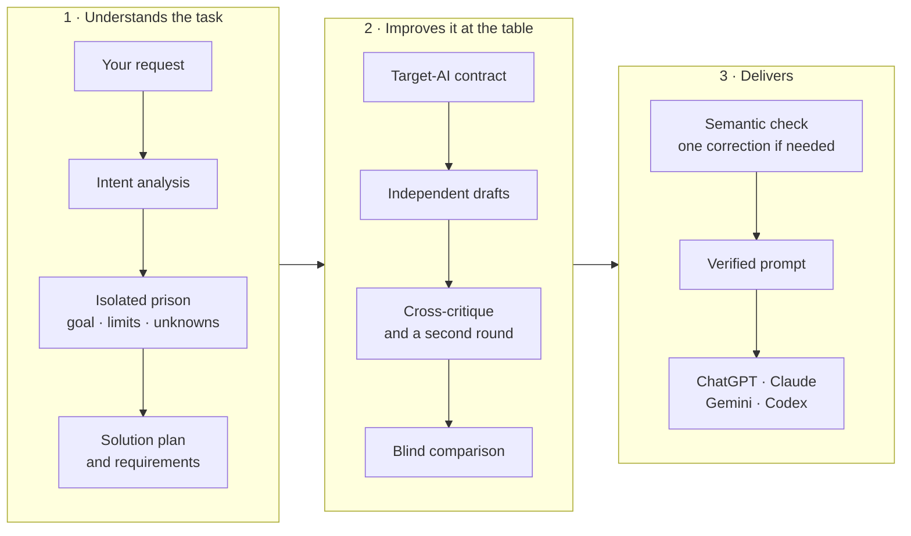

# PRISON

**English** · [简体中文](README.zh-CN.md) · [Türkçe](README.tr.md)

**Describe what you want; PRISON turns it into a verified prompt written for the AI you are going to use.**
<br><sub>Open-source prompt studio</sub>


An application that understands a request written in natural language, isolates it in its own **Prison
Instance**, turns it into a structured task and compiles a prompt optimized for the target AI (GPT, Claude,
Gemini, Codex).


You watch the models on stage while they really work on your request. Each model is played by its own Pırpır.
In the competition arena the candidates fight, the jury's scores become weapons and the strongest prompt wins.
At the team table the models converge on one shared text. Every moment on stage comes from a real recorded event.

## Contents

- [What it does](#what-it-does)
- [How to use it](#how-to-use-it)
- [Where to use the prompt](#where-to-use-the-prompt)
- [How it works](#how-it-works)
- [Screenshots](#screenshots)
- [FAQ](#faq)
- [Running](#running) · [Multi-model AI council](#multi-model-ai-council) · [Architecture](#architecture) · [API](#api)

## What it does

- **Clarifies what you want.** It separates the real goal of your request, the limits that must not change, the
  output format and the missing information; it does not invent unknowns, it asks you.
- **Writes for the AI you will use.** The prompt is prepared for ChatGPT, Claude, Gemini or Codex, and for a chat,
  phone, browser or tool-using agent setting.
- **Several models work together.** Optionally 3–6 different models draft independently, critique each other and
  are compared blind; the final text is not ready until it passes a semantic check.
- **Lets you watch the work.** The arena or the team table shows what the models proposed, what they changed and
  why, and who won.
- **You stay in control.** Correct the task in your own words, answer questions, lock limits, go back to earlier
  versions and choose your own API connections and models.

## How to use it

1. **Write your request.** Describe what you need in your own words in the "What do you want done?" (*Ne yaptırmak
   istiyorsun?*) box. The interface is in Turkish; the original labels are given in italics.
2. **Choose where the prompt will be used:** a normal chat (*Normal sohbet*), an AI on your phone (*Telefondaki AI*),
   an AI in your browser (*Tarayıcıdaki AI*) or a tool-using agent (*Araç kullanan agent*). As the prompt mode, pick
   "As requested" (*İsteğe göre*), "Standard" (*Standart*) or "JB mode" (*JB modu*).
3. **Choose the work table:** at the competition table (*Yarışma masası*) the models compete with separate
   candidates; at the team table (*Ekip masası*) they agree on one shared text.
4. **Review the plan and the questions.** Answer the missing-information questions; correct the task in your own
   words if needed.
5. **Watch the table.** Proposals, critiques and decisions appear on stage and in the transcript.
6. **Take the prompt and use it.** Copy the finished text and paste it into the target AI. If the result is not what
   you wanted, give feedback; PRISON produces a new version.

## Where to use the prompt

| Usage setting you chose | Where to paste the prompt | Best for |
| --- | --- | --- |
| Normal chat (*Normal sohbet*) | The web or desktop chat of ChatGPT, Claude or Gemini | Writing, plans, analysis, learning, one-off tasks |
| AI on your phone (*Telefondaki AI*) | The mobile apps of the same assistants | Short, step-by-step answers |
| AI in your browser (*Tarayıcıdaki AI*) | Assistants that can read pages and act in the browser | Web research, forms and page tasks |
| Tool-using agent (*Araç kullanan agent*) | Agents that work on code and files, such as Codex | Editing files in a project, running commands, tests |

If you leave the target AI on "auto", PRISON suggests the best fit for the kind of work and shows why.

## How it works



## Screenshots

| A strike | The team table |
| --- | --- |
|  |  |

| Start screen | On a phone |
| --- | --- |
|  |  |

## FAQ

**Does PRISON do the work for me?**
No. PRISON prepares the best prompt for the AI that will do the work. You run the prompt in your own AI. PRISON
never claims that the target AI has completed the task.

**Does it work without an API key?**
Yes. Without a key, the local rule-based engine runs the whole flow (analysis, compiling, revision, versions) and
the interface says so clearly. Deeper semantic analysis and the multi-model council need a provider key.

**Which providers and models can I use?**
NVIDIA, DeepSeek, Anthropic, OpenAI and OpenAI-compatible Chat Completions APIs over HTTPS. You can add and remove
your own connections and pick 3–6 different models for the council.

**Where are my keys and records kept?**
Keys are used only on the server and are never sent to the browser. Each task (prison) is stored in its own JSON
file, in the `data/prisons` folder by default.

**Is what I see in the arena real?**
Yes. Every moment on stage (proposal, critique, weapon, elimination, winner) comes from a real recorded event. No
score or content is made up. With reduced motion turned on, the stage is simplified.

**What is JB mode?**
A mode that rewrites the prompt with an expert framing specific to the task. It grants no new permissions and
does not promise to get around a target system's rules; the task's goal, limits and standing instructions are
kept.

## Running

```bash
npm install
npm run dev        # http://localhost:3100
```

AI provider: copy `.env.example` to `.env.local` and enter one key. Keys are used only on the server; do not add a
`NEXT_PUBLIC_` prefix and do not share `.env.local`. Restart the development server after changing the
environment.

| Variable | Description |
| --- | --- |
| `NVIDIA_API_KEY` | NVIDIA engine (default model `nvidia/nemotron-3.5-lightning-30b-a3b`) |
| `DEEPSEEK_API_KEY` | Official DeepSeek engine (default model `deepseek-flash`) |
| `ANTHROPIC_API_KEY` | Claude engine (default model `claude-opus-5-5`) |
| `OPENAI_API_KEY` | OpenAI engine (default model `gpt-5.5`) |
| `PRISON_PROVIDER` | `nvidia` \| `deepseek` \| `anthropic` \| `openai` \| `local` — forces the choice |
| `PRISON_MODEL` | Overrides the model name |
| `NVIDIA_BASE_URL` | NVIDIA API address (default `https://integrate.api.nvidia.com/v1`) |
| `DEEPSEEK_BASE_URL` | DeepSeek API address (default `https://api.deepseek.com/v1`) |
| `PRISON_DATA_DIR` | Folder for prison records (default `data/prisons`) |
| `PRISON_COUNCIL_MODE` | `enabled` turns the multi-model council on; default `off` |
| `PRISON_COUNCIL_MODELS` | 3–6 different NVIDIA API model IDs, comma-separated |
| `PRISON_COUNCIL_RESERVE_MODELS` | Up to 6 stand-in models that replace a member failing the pre-check. `none` turns the pre-check off |
| `PRISON_COUNCIL_DEPTH` | `deep` (default): an investigation round, at least 3 battle rounds, learning at the table and at least 2 approval rounds. `quick`: a short flow, 1–2 rounds in the competition |

Automatic selection priority is **NVIDIA → DeepSeek → Anthropic → OpenAI**. If the forced provider's key is missing
or the provider name is invalid, a clear configuration error is shown. NVIDIA model settings used with
`DEEPSEEK_API_KEY`/`PRISON_PROVIDER=deepseek` in the previous version are still supported; new installs should use
`NVIDIA_API_KEY` and `PRISON_PROVIDER=nvidia`.

Without a key the application runs on the **local rule-based engine** and says so clearly in the interface. The
local engine runs the whole flow (analysis, compiling, revision, versions) end to end, but semantic analysis needs
an AI provider.

NVIDIA and DeepSeek calls pass the real output schema to the model and ask for a JSON response. Responses are
validated locally; truncated responses and provider refusals are handled as separate errors. Call timeouts and
retry counts are limited. NVIDIA is retried once, after 500 ms, only on completed HTTP 429/503 responses; both
calls share the same budget of at most 180 seconds. Council steps may give a shorter budget. Timeouts and general
network errors are not retried automatically. For a truncated Ultra response the correction call raises the real
token budget from 8000 to 16000; the ceiling for NVIDIA is 32768. For Nemotron 3.5 Lightning,
`chat_template_kwargs.enable_thinking=false` is sent for JSON generation; planning, generation and final-text
review are separate steps of the application. This follows
[NVIDIA's structured output guide](https://docs.nvidia.com/nim/large-language-models/2.0.10/get-started/advanced/get-started-nemotron-3.5-lightning.html)
and keeps the response budget for the JSON result instead of a long internal trace.

When `nvidia/nemotron-3-ultra-550b-a55b` is selected, Ultra calls use `reasoning_effort=medium`,
`enable_thinking=true`, `medium_effort=true`, `temperature=1`, `top_p=0.95` and a budget of at least 8000 tokens.
These model-specific settings are not carried over to other providers. The
[NVIDIA Ultra API documentation](https://docs.api.nvidia.com/nim/reference/nvidia-nemotron-3-ultra-550b-a55b-infer)
describes the parameters; `reasoning_budget` is not sent because the hosted endpoint in this setup does not accept
it. Analysis and review can take longer on the larger model; failed or invalid responses are never saved as a
valid result. The Ultra response is received in chunks; only the final content chunks are joined, and the internal
thinking trace is never passed to the interface or the task record. A successful finish signal, complete JSON and
schema validation are required. The connection and the whole response stream share the same 180-second limit;
half a text does not count as success. A timeout is reported separately from a connection error.

For Super, the supported `low` reasoning is used instead of `medium`, and `high` for high-effort steps; its own
thinking template and NVIDIA's recommended sampling settings are sent. The
[Super model card](https://build.nvidia.com/nvidia/nemotron-3-super-120b-a12b/modelcard) explains these controls.
GPT-OSS calls run with their own effort and sampling settings; the output budget sent for 20B does not exceed the
hosted API's 4096-token limit. The [GPT-OSS 20B API documentation](https://docs.api.nvidia.com/nim/reference/openai-gpt-oss-20b-infer)
states this limit and the valid effort options.

The Claude engine uses structured outputs (`output_config.format`). The call is made with the selected model; a
refusal is shown as a clear error, and there is no implicit fallback to another model.

Other commands: `npm test` (vitest), `npm run typecheck`, `npm run build`.

### Multi-model AI council

With one NVIDIA key, real calls are made to different model endpoints; splitting the same model into six personas
does not count as six different models. The council is on in this setup.

Default council (per the live test of 4 October 2026): `nvidia/nemotron-3-ultra-550b-a55b`,
`nvidia/nemotron-3-super-120b-a12b`, `openai/gpt-oss-20b`, `meta/muse-glimmer-30b`,
`meta/llama-3.2-90b-vision-instruct`, `nvidia/nemotron-3.5-lightning-30b-a3b`. Because Ultra and Llama did not
respond in the latest connection tests on the development machine, the local setting uses Super as the main engine;
at the table, `poolside/laguna-xs-2.1` replaces Ultra and `nvidia/nemotron-3-nano-omni-30b-a3b-reasoning` replaces
Llama. The specialties of the other four seats are kept. Ultra and Llama are taken as stand-ins only if they pass
the pre-check. In the same test GLM-5.3, DeepSeek v4.1 Flash, Kimi K3 and Gemma 4 kept timing out, and many catalog
models returned 404 for that account. Model access changes over time: `npm run council:check` tries the models at
the table and `npm run council:check -- --catalog` tries every model the key lists. The key is never printed. The
number of configured models does not mean that all of them answered successfully at that moment. The council record
of a successful version shows separately which models completed and which failed.

Standard and JB prompts go through the same reviewed council. The user chooses a normal chat, phone, browser or
tool-using agent setting; this choice grants no account access or new permission. The agent choice is kept in sync
with the older Agent Mode switch. In both methods the task conditions are shared and binding; a majority view cannot
override the user's limits.

**Pre-check and stand-ins.** Before the council starts, each model passes a small JSON test of at most 20 seconds.
A model that does not respond is replaced by the first working stand-in from `PRISON_COUNCIL_RESERVE_MODELS`, in
the same seat with the same specialty (default stand-ins are in the code; `none` turns this off). The changes are
shown in the result panel.

**Depth.** `PRISON_COUNCIL_DEPTH=deep` is the default. With this setting:

- Before anyone writes, each model examines the task from its own specialty. Findings, risks, open questions and the
  approach are shared at the table; everyone writes their proposal learning from these notes. This is not web
  research: the models only examine the task state and the contract.
- In the competition there are at least 3 battle rounds before the final. If the jury still reports medium or high
  severity issues, or the best score keeps rising, it goes on for up to 5 rounds.
- At the team table, after the discussion the members improve their own proposals by learning from each other. The
  shared text is reviewed for at least 2 rounds even if everyone approves, and polished for up to 4 rounds while
  medium-level issues remain. If a later polish loses approval, the last approved text is kept.

`quick` uses the short flow; five or six candidates need two elimination rounds to come down to three finalists.
Even if evaluation calls fail, the round limit is not exceeded. If more than three candidates remain at the limit,
the rest go to a final independent evaluation; without enough evidence no winner is recorded. The duration of the
deep mode depends on provider responses; live runs over 25 minutes, and over 50 minutes on busy endpoints, have been
seen. Elapsed time alone does not end the job.

**Competition table = the arena.**

The stands hold four silhouette families of birds with five kinds of reaction; the same crowd move is not repeated
back to back. Reactions follow real stage events. Recorded speech quotes are read below the stage and do not cover
the characters on a phone. "Reading pace" (*Okuma temposu*) gives longer explanations more time, and a keyboard-accessible timeline
lets you jump to any real moment. The jury's evaluation is shown as a score. The same server update arriving again
does not reset the animation or the viewing time; playback stops at the end of the record. The reduced-motion
preference is respected.

1. The models produce independent candidates.
2. The jury (every model that produced a candidate, eliminated ones included) scores and critiques every candidate
   except its own on six criteria. On each criterion the round's best wins a "weapon": sword (goal alignment), bow
   (context), shield (limits), hammer (execution), spear (output), staff (target-AI fit).
3. If there are more than three candidates, the lowest averages are eliminated and join the jury (6 → 4 → 3). The
   rest strengthen their candidates with the critiques.
4. The three finalists are voted on without model names; nobody can vote for their own candidate. For a candidate
   to win, at least two thirds of the votes must be full approvals (at least 0.75 on every criterion) and at most
   one juror may have reported a high-severity issue.

**Team table = the dark room, no voting.** The models produce proposals and discuss each other's proposals from
their own specialty. A writer model merges all proposals and the discussion into a shared text. The table corrects
the text together until all other members give a clean approval. If there is no unanimity in the last round, the
latest text with broad agreement is used: at least two thirds of the members must have given full approval and no
second member may have joined a high-severity objection. A lone serious reservation is discussed in every round and
written into the decision, but it is not a veto. In live runs a single small model was seen repeating contradictory
"high" objections every round and locking the table. If no agreement emerges by the round limit, or the shared-text
writing calls cannot be completed, real candidates are not thrown away: if there is evidence from at least three
candidates and two independent evaluations, the strongest text at hand goes to the final review. The decision
record states clearly that there was no agreement, the objections and the members that did not respond. The same
hand-over applies in the arena; the choice is never shown as table approval or unanimity. Without enough real
candidates and evaluations, generation fails. In every case no new prompt is saved until the independent final
reviewer and the rule checks for the user's limits have passed.

Before the structured council starts, the task contract is checked against the real user instructions. If a derived
condition or the plan conflicts, only safe corrections are applied, the plan is renewed if needed and the contract
is checked once more. If the problem persists, the council does not start. The source check and the final-text check
can each make at most one repair.

In both methods the chosen full text also passes a task/source review by an independent model. If the review
rejects the text, the council is not rebuilt from scratch: the chosen text is corrected once with the findings and
reviewed independently again. If the chosen model cannot answer the correction call, another real juror can take
over the writing; it cannot evaluate itself. If no independent reviewer remains, the text is not saved. The deep
mode's 150-second call budget is kept for the final correction too. The first choice, the model that wrote the
correction and the final reviewer are stated separately in the result. The result is saved only if this check
passes as well. If the final reviewer is temporarily unavailable, the other jurors who approved the text take over
in turn. If the plan must be renewed for the correction and the main engine is temporarily overloaded, the council
members renew it. In both cases the work is still done by an AI call. If there is a serious finding or an
insufficient score on goal alignment or clarity of limits, the current solution plan is also renewed once; the full
text produced with the new task contract is reviewed again. The final reviewer record is updated to the model that
actually responded. Members that could not complete their review do not count as having approved, and missing
responses are stated in the decision text.

In juror calls, only temporary network, load and timeout errors get one extra attempt. A juror that returns an
authentication/configuration error is not called again in the same session; its absence is recorded. In the
final-text review another real independent juror can take over. Apart from its own correction attempt for an
invalid structured response, the same round is not repeated; the next round of the new text can be evaluated again.

A selection without agreement is shown on stage as **the candidate chosen for the final review**; no agreement or
victory animation is played. In the saved prompt that passed the final check, the basis of the choice is kept
separately. Older records keep loading without the new fields.

Compiling, target/modifier changes and revisions are accepted immediately with HTTP 202; the long AI work runs as a
local server job independent of the browser connection. Job status and the latest discussion are kept under
`data/prisons/.operations` (under that directory if `PRISON_DATA_DIR` changes). The browser puts no limit on the
total generation time; if a short status read times out, it follows the same job again and does not start a second
generation. After a page reload the selected task's job is found again; when it finishes, the new prompt loads
automatically. If there is an error, the discussion, the clear cause and a retry button stay visible; the previous
valid prompt is kept.

New job records also store the generation settings sent, the change, the revision message or the answers to
questions. **Retry the same operation** (*Aynı işlemi yeniden dene*) reuses them exactly on the server; it does not turn into a different
generation with old task settings. If the task or the last operation has changed, a retry of the old request is
refused. Older job records do not hold this information, so **Regenerate the prompt** (*Promptu yeniden üret*) starts a new generation for
the current task.

The full draft chosen by the council is saved privately under `data/prisons/.council-checkpoints` before the final
review starts. This draft is not an approved prompt version and is not exposed through the public API. If the
connection drops during the final correction or review, a retry continues from the remaining stage; a successfully
corrected text is not written again, only reviewed. If the task, user instructions, settings, the active version or
the model configuration has changed, the old draft is not used. For a text that fails the quality check after
correction, a new council is set up. The private draft is cleared once the new prompt is saved permanently. When the
same text revision or the same question/answer pair is retried, the prepared revision and the identity of the real
user record are kept; analysis, planning and discussion are not repeated. If the question context, the answer or
the active user branch changes, a new analysis and discussion are run.

While the first generation runs the status shows **Generating** (*Üretiliyor*); while an existing prompt is being prepared
again it shows **Preparing a new version** (*Yeni sürüm hazırlanıyor*). Elapsed time is computed from the saved real start; a page reload or a stage
change does not reset the counter. This counter is not an estimate of when it will finish.

A running job keeps its lock and progress across code reloads within the same server process. If the server or the
computer shuts down, running API calls do not continue. On restart the old job is marked `interrupted`; the latest
discussion and the valid prompt are kept, and the user can retry. If a full draft had been chosen and saved
privately, the job continues from the remaining final review; if no candidate had been chosen yet, the council is set
up again. This job runner is for the local Node server; a serverless deployment needs a persistent external job
queue. A second generation, deletion or a version restore on the same task cannot change the running operation.

**Memory.** When regenerating or revising, the council result of the displayed version (the adopted direction and
open findings) is given to the new council as working memory. This information does not count as a user instruction
or permission; if the current task and revisions differ, they prevail.

**Visual council.** While the council works and afterwards, a 3D scene (three.js) is shown: at the team table,
colorful Pırpır birds sit under the lamp in a dark room; in the competition they fight on a green field. The
speaking model glows green and the thinking model blinks. Speech bubbles quote the proposals, critiques and
decisions the models shared at the table; no hidden internal thinking trace is recorded. Saved versions can be
replayed from the start, stepped through, and the transcript can be read.

At least three separate models must produce real candidates; the candidate behind a choice needs a comparison by
at least two independent models. A member whose investigation note could not be obtained can still try to produce a
candidate; missing investigation or evaluation responses do not count as success. Three jobs run at the same time;
the structured-response attempts of one model share a common budget of 90 seconds in quick mode and 150 seconds in
deep mode (the writer's merge call has 150 seconds). A juror evaluation that returns broken JSON asks for one
correction within the same budget. With insufficient participation or a failed final review, the existing record is
kept; a local text is never presented as a multi-model success. Scores are model evaluations, not a guarantee of
correctness or success.

The design draws on approaches studied on GitHub: parallel/joint work in
[Microsoft Agent Framework](https://github.com/microsoft/agent-framework), independent judging in
[ChatEval](https://github.com/thunlp/ChatEval) and mutual correction over limited rounds in
[Multiagent Debate](https://github.com/composable-models/llm_multiagent_debate). The flow is implemented in the
existing TypeScript application. No runtime from external projects was installed; only the `three` package was added
for the visual scene, and it loads in the browser only when the scene is opened.

### Request screen

- **Prompt mode:** "As requested" interprets a mode request in the text; "Standard" and "JB mode" are sent to the
  server as explicit choices. When JB is selected, the input is shown with a red frame.
- **Draft recovery:** The request text, target AI, language, mode, usage setting and table choice are saved
  automatically in this browser. After a reload the draft comes back; it is cleared after a successful analysis. A
  failed analysis keeps the draft.
- **Connection check:** The "Check connection" (*Bağlantıyı kontrol et*) button in the side menu verifies the connection by asking the
  selected model for a small JSON response. No remote check runs when the page opens; concurrent checks share the
  same request. The check result does not change task records.
- **Solution plan:** The API analysis extracts the real goal of the request, the steps to carry out, the purpose of
  each step and its check criterion. The target-AI choice and its reason are visible; an explicit user choice is
  kept.
- **Missing information:** Questions that change the result are shown and can be answered before the first prompt.
  In the first round the three most important questions are offered with separate answer fields. Known questions can
  be answered partially; the question context and the user's answer are sent to the real revision API in separate
  fields. A system question never counts as a user instruction, permission or source quote. On a failed operation the
  answer fields are kept; on success the task and the solution plan are renewed. The model is asked not to ask again
  for information already answered and to prioritize the remaining important questions in the next round. The task
  can also be corrected with free text. When the task changes, the plan is prepared again from the current
  requirements and task memory. Unknowns are never filled in as if they were facts.
- **Proof of generation:** Standard and JB versions show the real generation source and the layer that reviewed the
  final text. These reviews are about the prompt; the application never claims the target AI has completed the work.

### Your AI team and taking part

From **My AI team · API settings** (*AI ekibim · API ayarları*) in the side menu you can add and remove connections and choose the analysis model
for quick single-model generation, plus an optional team of 3–6 different models for detailed table/arena work. NVIDIA, DeepSeek, OpenAI, Anthropic and OpenAI-compatible Chat
Completions APIs over HTTPS are supported. Model IDs and specialties are set by the user; provider access is tested
before real generation. Saving makes no remote API call. No stand-in model the user did not choose is added to the
saved team; operations already started finish with their own connections.

Keys are stored on the server in `PRISON_DATA_DIR/.provider-settings.json`; this local file is not encrypted. Keys
are never sent back to the browser or written to browser storage. An empty key keeps the existing one; **Remove key**
(*Anahtarı kaldır*) removes it explicitly. Changing the address or provider requires a new key. Until the first save the environment
settings are used; **Back to the starting team** (*Başlangıç ekibine dön*) removes the saved settings and returns to the environment settings.
Setting changes apply to new generations.

The system selects 50 different joint gestures automatically from the actual work events; viewers do not choose
animations. Seated characters and wings carrying items are respected. Gestures vary by character and by the real
event; the same clip is not chosen twice in a row. Replay controls do not change the background API operation,
jury scores or event record.
Weapons are carried at wing/back attachment points; an open equipment guide shows the real jury criterion behind each
one and its current holder.

Goal/limit/output hints are added to the user's visible request. Closable **How do I use this?** (*Nasıl kullanırım?*) explanations give
guidance suited to each stage. In the finished version the full prompt can be copied or downloaded as `.txt`; sending
it to another AI is up to the user. Feedback on the result goes into the real revision flow; no success message is
shown before it completes. A failed discussion record is never presented as a finished prompt.

The result includes a task-specific starter route to Codex, Claude Code, ChatGPT, Claude, Gemini or Kimi, with
official setup links, preparation steps and output checks. Visual 3D modeling routes include Blender installation
and scripting instructions; software viewers and language/data models keep their own routes. The guide uses the
displayed prompt version's task snapshot and leaves the copied prompt unchanged. Switching the interface between
Turkish, English and Simplified Chinese preserves requests and stored prompts; prompt language is chosen separately.

The purpose of this structure and the rules for extending it: [product system](docs/product-system.en.md).

## Architecture

```
src/
  models/              Zod schemas = single source of truth (Prison, Spec, Intent, Prompt, Options)
  templates/           Shared prompt texts: phrases, block headings, task-type profiles,
                       family templates, engine system prompts, UI labels
  core/
    intent-engine/     Semantic analysis with an LLM (structured output + validation + controlled retry);
                       a keyless fallback analyzer under local/
    task-types/        Extensible task-type registry (no switch-case)
    prison-engine/     Prison creation, state machine, item/ID management, patch + task memory, modifiers
    requirement-resolver/  Intent → normalized Prison Spec; safety and profile defaults
    context-engine/    Isolation boundary: the compiler/LLM only ever gets ONE prison's state
    prompt-compiler/   Block selection → block building → (shortening) → adapter → ordering → render
    prompt-refiner/    Task-specific API guidance for the standard prompt; the binding contract is kept
    jailbreak-engine/  Task-specific framing for JB; merged with the full task contract
    prompt-critic/     Rule-based + LLM critic; corrections are applied to the state as patches
    output-validator/  Structural validation
    revision-engine/   Free-text revision → StatePatch (LLM or local)
    pipeline/          analyze / compile / revise / adjust / restore flows
  adapters/            gpt, claude, gemini, codex + AUTO resolver
  services/
    ai/                NVIDIA / DeepSeek / Anthropic / OpenAI providers, error mapping, structured.ts
    storage/           A separate JSON file per prison, atomic writes, schema-validated reads
    prison-service.ts  Locking + persistence + input checks
  app/api/             REST endpoints
  ui/                  composer, intent-preview, prison-sidebar, prompt-output, revision-chat,
                       council-arena (3D table/arena scene, timeline, speech bubbles)
```

### Core rules

- **Prison = the core architecture.** Each request is stored separately as `data/prisons/pr_xxxxxxxx.json`. No
  operation reads two prisons together.
- **The Prompt Compiler uses only the active prison's state.** It is a pure function
  (`compilePrompt(toCompileInput(prison))`): same state → same prompt; no outside information can leak in.
- **AI output is not trusted.** Every LLM response goes through JSON parsing + Zod validation + a semantic check; on
  failure it is requested again **once** with the errors attached. No endless retries. The final compiled prompt is
  validated again after corrections; invalid output is never saved as a new version.
- **The user's words take precedence over interpretation.** The model's free sub-goals are marked as implicit
  interpretation; real user quotes are kept as explicit instructions. Analysis, planning, JB/standard generation and
  the jury use the same meaning rules: a suggestion does not create an extra prohibition, and a negative instruction
  stays negative when written in the requirements list.
- **The final text is really reviewed.** With an AI engine selected, standard and JB generation are written through
  the API; the merged text to be saved is sent to the critic. If needed, safe state corrections are applied and the
  API does **one** regeneration with the feedback. The new text is evaluated again. Explicit conditions, conditions
  from revisions, required implicit conditions and memory-bound items cannot be deleted by the critic. If a serious
  issue or a weak quality dimension remains, the new version is not accepted.
- **The user's real words are kept.** An item the AI summary misread can only be corrected with a verbatim quote that
  can be verified from the original request or an active user revision. The reviewer picks one of the real user
  statements numbered by the application; it does not rewrite the quote. The application verifies the source of the
  choice and the protections of the item to be changed. Memory-bound and explicit items cannot be changed this way.
  An independent check that catches a rejected condition being made mandatory does not accept the result even if the
  critic scores it high. A solution plan that conflicts with the corrected task is prepared and reviewed again.
  Model assumptions the user did not state, and that are not bound to memory, can be cleaned up; user conditions,
  required implicit conditions and remaining unknowns cannot be deleted through this exception. New permission claims
  the reviewer adds for actions such as publishing/deploying are accepted only if they can be verified, together
  with their conditions, from a real user sentence.
- **The output format comes first.** Detailed mode does not add decision explanations or report sections to a task
  that asks only for a table/JSON/code. Planning and verification are working steps; the final answer reports only
  the information that is part of the requested output.
- **Restoring a version also rolls back the scope of instructions.** The revision history is kept; later
  instructions that were rolled back do not mix into the new compilation. New instructions given after the restore
  take effect.
- **Assumptions and unknowns are separate.** In the prompt they sit in separate blocks headed "not verified
  information" and "do not invent an answer".
- **Lock the scope, not the ability to solve.** Strict/free scope modes never loosen protections.
- **Task memory.** Standing directives such as "don't deploy" or "don't change the architecture" are written into the
  prison's memory and protect the items they are bound to; they are lifted only if explicitly withdrawn. They never
  carry over to another prison. In new API revisions each directive reports the verbatim texts of its related items;
  the application binds only the matches added or confirmed in that revision. Unrelated menu/context information is
  not swept into another directive's protection. An invalid binding is verified again; existing protections of older
  records are never loosened on their own.
- **JB mode.** The mode, shown with a red frame, can be chosen before analysis; the choice is saved to the prison and
  the prompt version. The generation source (local/API), provider and model are tracked with the version. Changing
  the mode never deletes the task's goal, explicit requirements, protections or standing instructions. The framing
  is prepared for the task type, the solution plan, the target AI and the chat/mobile/browser/agent setting; a Codex
  task that asks only for advice is not turned into file changes. In analysis/advice tasks the introduction and the
  binding contract use the same evaluation flow; choosing a coding profile does not add instructions for automatic
  application, running a build or changing test files. This limit is kept in standard mode as well; when recompiling,
  the default application steps and success criteria of older records are adapted to the advice flow, and items
  belonging to the user are kept. Special review criteria for research and data-analysis protocols and for security,
  architecture and interface reviews are kept. Short/standard/detailed introductions are limited to
  1500/3500/6000 characters respectively; the full task contract is kept separately. Role, steps, missing context,
  output and acceptance checks are specific to the task. It never asks for the model's hidden thinking trace; it asks
  for concrete results and verification evidence. The label does not guarantee the target AI's behaviour or create
  new permissions.

### State machine

```
RAW_REQUEST → INTENT_PARSED → PRISON_CREATED → REQUIREMENTS_RESOLVED → READY_FOR_COMPILE
READY_FOR_COMPILE → PROMPT_COMPILED → PROMPT_VALIDATED → READY
READY → USER_REVISION → PRISON_UPDATED → PROMPT_RECOMPILED → PROMPT_VALIDATED → READY
```

If an AI call needed for analysis, plan renewal, generation or the final-text review fails, no new prompt version is
saved; the prison stays in its last valid state. The failed state of the background job and its discussion are
recorded separately. An API error is never hidden behind a local result. In the keyless local mode the compiler and
rule checks run; it is never shown as if an AI review had been done. The application produces a prompt for the
chosen AI; it does not send that prompt to a second API to carry out the user's actual work.

### Extending

- **New task type:** add a profile to `src/templates/task-types.ts` (or `registerTaskType` at runtime). The intent
  schema, the catalog and the compiler use it automatically.
- **New target model:** implement the `TargetAdapter` interface (`src/adapters/types.ts`), register it with
  `registerAdapter` and add it to the `CONCRETE_TARGETS` list.
- **New AI provider:** implement the `LLMProvider` interface (`src/services/ai/types.ts`).

## API

| Method | Path | Purpose |
| --- | --- | --- |
| GET | `/api/engine` | Active engine |
| GET / PUT / DELETE | `/api/settings/providers` | Keyless settings summary / revision-checked team save / back to environment settings |
| POST | `/api/engine/check` | Check the selected engine's connection (`{ health }`) |
| GET / POST | `/api/prisons` | List / new prison (request analysis) |
| GET / DELETE | `/api/prisons/:id` | Read / delete a prison |
| POST | `/api/prisons/:id/compile` | First compile or regeneration; HTTP 202 `{ accepted: true, operation }` |
| POST | `/api/prisons/:id/adjust` | `{ action }` modifier or `{ target }` target change; HTTP 202 job accepted |
| POST | `/api/prisons/:id/revise` | `{ message }` revision or `{ clarifications: [{ question, answer }] }` answers; HTTP 202 job accepted |
| GET | `/api/operations/:id` | Status of an accepted job, its latest discussion, the cause of an error and the resulting version |
| GET | `/api/prisons/:id/operation` | The task's latest job; to find the same operation after a reload |
| GET | `/api/prisons/:id/progress` | Live progress only, for older clients |
| POST | `/api/prisons/:id/restore` | `{ version }` restore a version |
