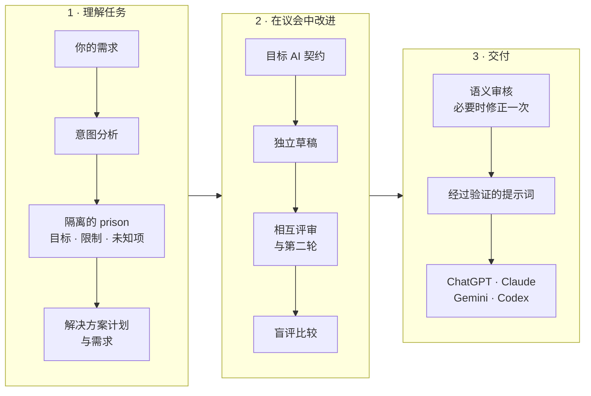

# PRISON

[English](README.md) · **简体中文** · [Türkçe](README.tr.md)

**说出你的需求，PRISON 把它变成为你要使用的 AI 量身编写、并经过审核的提示词。**
<br><sub>开源提示词工作室</sub>


PRISON 是一个应用程序：它理解用自然语言写下的需求，把需求隔离在独立的 **Prison 实例**（Prison Instance）中，
转换为结构化任务，并为目标 AI（GPT、Claude、Gemini、Codex）编译经过优化的提示词。


当各个模型真正在处理你的需求时，你可以在舞台上观看它们的工作。每个模型都由自己的 Pırpır 小鸟扮演。
在竞技场中，各个候选提示词相互较量，评审团的评分化为武器，最强的提示词胜出。
在团队桌上，模型们则就一份共同文本达成一致。舞台上的每一个瞬间都来自记录中的真实事件。

## 目录

- [功能概览](#功能概览)
- [使用方法](#使用方法)
- [在哪里使用提示词](#在哪里使用提示词)
- [工作原理](#工作原理)
- [截图](#截图)
- [常见问题](#常见问题)
- [运行](#运行) · [多模型 AI 议会](#多模型-ai-议会) · [架构](#架构) · [API](#api)

## 功能概览

- **理清你的真实需求。** 它会区分需求的真正目标、不能改变的限制、输出格式以及缺失的信息；
  不会编造未知内容，而是向你提问。
- **按你要使用的 AI 来写。** 提示词分别为 ChatGPT、Claude、Gemini 或 Codex 准备，并适配聊天、手机、
  浏览器或会使用工具的智能体（agent）环境。
- **默认快速，需要深度时再用议会桌。** 由一个 AI API 直接写出提示词，最终文本仍会被审核。
  做细致的工作时，可由 3–6 个不同模型各自独立起草、相互评审并进行盲评比较；最终文本在通过语义审核之前不会被视为完成。
- **支持三种语言。** 能理解英语、土耳其语和简体中文的需求，并用其中任一语言写出提示词；界面也可在这三种语言之间切换。
- **让你看到工作过程。** 竞技场或团队桌会展示模型提出了什么、改了什么、为什么改，以及谁胜出。
- **由你掌控。** 你可以用自己的话修改任务、回答问题、锁定限制、回到早期版本，并选择自己的 API 连接和模型。

## 使用方法

1. **写下你的需求。** 在"你想让 AI 做什么？"（*Ne yaptırmak istiyorsun?*）输入框里用自己的话描述需求。
   选择提示词语言（EN / TR / 中文）；界面语言在侧边栏中单独切换。土耳其语原始标签以斜体给出。
2. **选择提示词的使用场景：** 普通聊天（*Normal sohbet*）、手机上的 AI（*Telefondaki AI*）、
   浏览器中的 AI（*Tarayıcıdaki AI*）或会使用工具的智能体（*Araç kullanan agent*）。
   提示词模式可选"按需求"（*İsteğe göre*）、"标准"（*Standart*）或"JB 模式"（*JB modu*）。
3. **选择工作方式**（*Çalışma biçimi*）：默认的 **快速 · 单模型**（*Hızlı · tek model*）由一个模型直接写出提示词。
   做细致的工作时，在竞技桌（*Yarışma masası*）上，模型用各自的候选提示词竞争；
   在团队桌（*Ekip masası*）上，模型就一份共同文本达成一致。
4. **检查计划和问题。** 回答缺失信息的问题；如有需要，用自己的话修正任务。
5. **如果选择了议会桌，可以观看。** 提案、评审和决定会显示在舞台上和对话记录中。
6. **取用提示词。** 复制完成的文本，粘贴到目标 AI 中。如果结果不理想，给出反馈，PRISON 会生成新版本。

## 在哪里使用提示词

| 你选择的使用场景 | 粘贴提示词的位置 | 最适合的工作 |
| --- | --- | --- |
| 普通聊天（*Normal sohbet*） | ChatGPT、Claude 或 Gemini 的网页版或桌面版聊天 | 写作、计划、分析、学习、一次性任务 |
| 手机上的 AI（*Telefondaki AI*） | 同类助手的手机应用 | 简短、分步骤的回答 |
| 浏览器中的 AI（*Tarayıcıdaki AI*） | 能在浏览器中阅读网页并执行操作的助手 | 网络调研、表单和网页任务 |
| 会使用工具的智能体（*Araç kullanan agent*） | 在代码和文件上工作的智能体，例如 Codex | 在项目中编辑文件、运行命令、测试 |

如果把目标 AI 保持为"自动"，PRISON 会根据任务类型推荐最合适的一个，并说明理由。

## 工作原理



## 截图

| 一次攻击 | 团队桌 |
| --- | --- |
|  |  |

| 开始界面 | 手机上 |
| --- | --- |
|  |  |

## 常见问题

**PRISON 会替我完成工作吗？**
不会。PRISON 为将要完成工作的 AI 准备最好的提示词，由你在自己的 AI 中运行它。PRISON 从不声称目标 AI 已经完成了任务。

**没有 API 密钥能用吗？**
可以。没有密钥时，本地的基于规则的引擎会运行完整流程（分析、编译、修订、版本），界面也会明确说明这一点。
更深入的语义分析和多模型议会需要服务商密钥。

**可以使用哪些服务商和模型？**
NVIDIA、DeepSeek、Anthropic、OpenAI，以及通过 HTTPS 访问的 OpenAI 兼容 Chat Completions API。
你可以添加和移除自己的连接，并为议会选择 3–6 个不同的模型。

**我的密钥和记录保存在哪里？**
密钥只在服务器端使用，从不发送到浏览器。每个任务（prison）都保存在各自的 JSON 文件中，默认位于 `data/prisons` 文件夹。

**竞技场里看到的是真的吗？**
是的。舞台上的每个瞬间（提案、评审、武器、淘汰、获胜者）都来自记录中的真实事件，不会编造任何分数或内容。
开启"减少动态效果"时，舞台会被简化。

**JB 模式是什么？**
一种用针对任务的专家框架重写提示词的模式。它不授予新的权限，也不承诺绕过目标系统的规则；
任务的目标、限制和长期指令都会被保留。

## 运行

```bash
npm install
npm run dev        # http://localhost:3100
```

AI 服务商：把 `.env.example` 复制为 `.env.local` 并填入一个密钥。密钥只在服务器端使用；
不要添加 `NEXT_PUBLIC_` 前缀，也不要分享 `.env.local`。修改环境设置后请重启开发服务器。

| 变量 | 说明 |
| --- | --- |
| `NVIDIA_API_KEY` | NVIDIA 引擎（默认模型 `nvidia/nemotron-3.5-lightning-30b-a3b`） |
| `DEEPSEEK_API_KEY` | 官方 DeepSeek 引擎（默认模型 `deepseek-flash`） |
| `ANTHROPIC_API_KEY` | Claude 引擎（默认模型 `claude-opus-5-5`） |
| `OPENAI_API_KEY` | OpenAI 引擎（默认模型 `gpt-5.5`） |
| `PRISON_PROVIDER` | `nvidia` \| `deepseek` \| `anthropic` \| `openai` \| `local` — 强制选择 |
| `PRISON_MODEL` | 覆盖模型名称 |
| `NVIDIA_BASE_URL` | NVIDIA API 地址（默认 `https://integrate.api.nvidia.com/v1`） |
| `DEEPSEEK_BASE_URL` | DeepSeek API 地址（默认 `https://api.deepseek.com/v1`） |
| `PRISON_DATA_DIR` | prison 记录所在文件夹（默认 `data/prisons`） |
| `PRISON_COUNCIL_MODE` | `enabled` 开启多模型议会；默认 `off` |
| `PRISON_COUNCIL_MODELS` | 3–6 个不同的 NVIDIA API 模型 ID，用逗号分隔 |
| `PRISON_COUNCIL_RESERVE_MODELS` | 最多 6 个替补模型，替换未通过预检的成员。`none` 关闭预检 |
| `PRISON_COUNCIL_DEPTH` | `deep`（默认）：一轮调查、至少 3 轮对战、议会中的相互学习以及至少 2 轮批准。`quick`：简短流程，竞技中 1–2 轮 |

自动选择的优先级为 **NVIDIA → DeepSeek → Anthropic → OpenAI**。如果强制指定的服务商缺少密钥或名称无效，
会显示清晰的配置错误。上一版本中通过 `DEEPSEEK_API_KEY`/`PRISON_PROVIDER=deepseek` 使用的 NVIDIA 模型设置仍受支持；
新安装请使用 `NVIDIA_API_KEY` 和 `PRISON_PROVIDER=nvidia`。

没有密钥时，应用使用**本地基于规则的引擎**运行，并在界面中明确说明。本地引擎端到端运行完整流程
（分析、编译、修订、版本），但语义分析需要 AI 服务商。

NVIDIA 和 DeepSeek 调用会把真实的输出 schema 传给模型并要求 JSON 响应。响应在本地验证；被截断的响应和服务商拒绝
作为不同的错误处理。调用的超时和重试次数都有限制。NVIDIA 只在完整返回 HTTP 429/503 时于 500 毫秒后重试一次；
两次调用共享同一个最长 180 秒的时间预算。议会步骤可能给出更短的预算。超时或一般网络错误不会自动重试。
对于被截断的 Ultra 响应，修正调用会把实际 token 预算从 8000 提高到 16000；NVIDIA 的上限为 32768。
对于 Nemotron 3.5 Lightning，生成 JSON 时会发送 `chat_template_kwargs.enable_thinking=false`；
规划、生成和最终文本评估是应用中的独立步骤。这一设置遵循
[NVIDIA 的结构化输出指南](https://docs.nvidia.com/nim/large-language-models/2.0.10/get-started/advanced/get-started-nemotron-3.5-lightning.html)，
使响应预算用于 JSON 结果，而不是冗长的内部推理。

选择 `nvidia/nemotron-3-ultra-550b-a55b` 时，Ultra 调用使用 `reasoning_effort=medium`、`enable_thinking=true`、
`medium_effort=true`、`temperature=1`、`top_p=0.95` 以及至少 8000 token 的预算。这些模型专属设置不会带到其他服务商。
[NVIDIA Ultra API 文档](https://docs.api.nvidia.com/nim/reference/nvidia-nemotron-3-ultra-550b-a55b-infer)
说明了这些参数；由于本环境中的托管端点不接受 `reasoning_budget`，因此不发送它。在更大的模型上，分析和审核可能需要更长时间；
失败或无效的响应绝不会被当作有效结果保存。Ultra 响应分块接收；只拼接最终内容块，内部推理过程不会传给界面或任务记录。
需要成功结束标记、完整 JSON 和 schema 验证。连接和整个响应流共享同一个 180 秒限制；半截文本不算成功。
超时与连接错误会分别说明。

对于 Super，使用其支持的 `low` 推理级别代替 `medium`，在需要高投入的步骤中使用 `high`；并发送它自己的思考模板以及
NVIDIA 推荐的采样设置。[Super 模型卡](https://build.nvidia.com/nvidia/nemotron-3-super-120b-a12b/modelcard) 说明了这些控制项。
GPT-OSS 调用使用各自的投入和采样设置；为 20B 发送的输出预算不超过托管 API 的 4096 token 限制。
[GPT-OSS 20B API 文档](https://docs.api.nvidia.com/nim/reference/openai-gpt-oss-20b-infer) 说明了这一限制和有效的投入选项。

Claude 引擎使用结构化输出（`output_config.format`）。调用使用所选模型；拒绝会显示为清晰的错误，不会隐式转向其他模型。

其他命令：`npm test`（vitest）、`npm run typecheck`、`npm run build`。

### 多模型 AI 议会

用一个 NVIDIA 密钥向不同的模型端点发起真实调用；把同一个模型拆成六个角色不算六个不同的模型。本环境中议会已就绪，
为任务选择议会桌时才会运行；默认仍是快速的单模型路径。

默认议会（根据 2026 年 10 月 4 日的实测）：`nvidia/nemotron-3-ultra-550b-a55b`、`nvidia/nemotron-3-super-120b-a12b`、
`openai/gpt-oss-20b`、`meta/muse-glimmer-30b`、`meta/llama-3.2-90b-vision-instruct`、`nvidia/nemotron-3.5-lightning-30b-a3b`。
由于在开发机器上最近的连接测试中 Ultra 和 Llama 没有响应，本地设置使用 Super 作为主引擎；
议会中由 `poolside/laguna-xs-2.1` 替代 Ultra，由 `nvidia/nemotron-3-nano-omni-30b-a3b-reasoning` 替代 Llama。
其余四个席位的专长保持不变。Ultra 和 Llama 只有在通过预检时才会作为替补加入。在同一次测试中，GLM-5.3、
DeepSeek v4.1 Flash、Kimi K3 和 Gemma 4 持续超时，目录中的许多模型对该账号返回 404。模型的可用性会随时间变化：
`npm run council:check` 测试议会中的模型，`npm run council:check -- --catalog` 测试密钥能列出的所有模型。密钥不会被打印出来。
已配置的模型数量并不意味着它们当时都成功响应。成功版本的议会记录会分别显示哪些模型完成、哪些出错。

标准提示词和 JB 提示词都经过同一个受审核的议会。用户选择普通聊天、手机、浏览器或会使用工具的智能体环境；
这一选择不授予账户访问权或新的权限。智能体选项会与旧的 Agent 模式开关保持同步。两种方式中任务条件都是共同且有约束力的；
多数意见不能越过用户的限制。

**预检与替补。** 议会开始前，每个模型都要通过一个最长 20 秒的小型 JSON 测试。未响应的模型由
`PRISON_COUNCIL_RESERVE_MODELS` 列表中第一个可用的替补模型替代，坐在同一席位、拥有相同专长
（默认替补写在代码中；`none` 关闭此功能）。这些变化会在结果面板中显示。

**深度。** 默认为 `PRISON_COUNCIL_DEPTH=deep`。在此设置下：

- 在任何人写作之前，每个模型先从自己的专长出发审视任务。发现、风险、未决问题和思路会分享到议会中；
  每个人都在学习这些笔记后写出自己的提案。这不是网络调研：模型只审视任务状态和契约。
- 在竞技中，决赛前至少进行 3 轮对战。如果评审团仍报告中等或高严重性的问题，或最佳分数仍在上升，最多会进行 5 轮。
- 在团队桌上，讨论之后成员们互相学习、改进自己的提案。即使所有人都批准，共同文本也至少要审核 2 轮；
  只要还有中等程度的问题，最多打磨 4 轮。如果之后的一次打磨失去了批准，则保留最后一个被批准的文本。

`quick` 使用简短流程；五个或六个候选降到三个决赛候选需要两轮淘汰。即使评估调用失败，也不会超过轮次上限。
如果到上限时剩余候选多于三个，其余候选进入最后一次独立评估；证据不足时不记录获胜者。深度模式的耗时取决于服务商的响应；
实测中见过超过 25 分钟、在繁忙端点上超过 50 分钟的流程。单凭经过的时间不会终止任务。

**竞技桌 = 竞技场。**

看台上的小鸟有四种轮廓家族和五种反应方式；同一个观众动作不会连续重复。反应与真实的舞台事件相关。
记录下来的发言引用在舞台下方阅读，在手机上不会遮挡角色。"阅读节奏"（*Okuma temposu*）为较长的说明留出更多时间，
支持键盘操作的时间轴可以跳到任何一个真实时刻。评审团的评估以分数显示。同一条服务器信息再次到达时，
不会重置动画和观看时间；记录结束时播放停止。"减少动态效果"偏好会被遵守。

1. 各个模型生成独立的候选提示词。
2. 评审团（所有生成过候选的模型，包括已被淘汰的）按六项标准为除自己之外的每个候选打分并评审。
   在每项标准上，该轮的最佳者赢得一件"武器"：剑（目标契合）、弓（上下文）、盾（限制）、锤（执行）、矛（输出）、法杖（目标 AI 适配）。
3. 如果候选多于三个，平均分最低的会被淘汰并加入评审团（6 → 4 → 3）。其余候选根据评审意见强化自己的提示词。
4. 三个决赛候选在不显示模型名称的情况下投票；任何人都不能投给自己的候选。候选要获胜，至少三分之二的票必须是完全批准
   （每项标准至少 0.75），且最多只能有一位评审报告了高严重性问题。

**团队桌 = 暗室，不投票。** 模型们提出提案，并从各自的专长出发讨论彼此的提案。一个执笔模型把所有提案和讨论合并为共同文本。
议会共同修正文本，直到其他所有成员都给出干净的批准。如果最后一轮没有达成一致，则使用最近一次获得广泛共识的文本：
至少三分之二的成员给出完全批准，且没有第二位成员加入高严重性的反对。单独一方的严重保留意见每轮都会讨论并写入决定，
但不构成否决。在实测中曾看到一个小模型每轮都重复相互矛盾的"高"级反对，导致议会僵持。如果到轮次上限仍未达成一致，
或者无法完成共同文本的写作调用，真实的候选不会被丢弃：如果有至少三个候选和两次独立评估的证据，手头最强的文本会进入最终审核。
决定记录会明确说明没有达成一致、有哪些反对以及哪些成员没有响应。同样的移交也适用于竞技场；这一选择不会被展示为议会批准或全票通过。
没有足够的真实候选和评估时，生成会失败。无论哪种情况，在独立的最终审核者和针对用户限制的规则检查通过之前，都不会保存新的提示词。

在结构化议会开始之前，任务契约会与真实的用户指令进行核对。如果某个推导出的条件或计划与之冲突，只会应用安全的修正，
必要时更新计划，并再次核对契约。如果问题仍然存在，议会不会开始。来源审核和最终文本审核各自最多进行一次修复。

两种方式中，被选中的完整文本还要经过一个独立模型的任务/来源审核。如果审核拒绝了文本，议会不会从头重建：
被选中的文本会根据发现修正一次，然后再次接受独立审核。如果被选中的模型无法响应修正调用，另一位真实的评审可以接手写作；
它不能评估自己。如果没有剩余的独立审核者，文本不会被保存。深度模式 150 秒的调用预算在最终修正时同样保留。
最初的选择、写修正的模型和最终审核者会在结果中分别注明。只有这项检查也通过时才会保存结果。
如果最终审核模型暂时无法响应，批准过该文本的其他评审会依次接手。如果修正需要更新计划而主引擎暂时过载，则由议会成员更新计划。
两种情况下工作仍然由 AI 调用完成。如果在目标契合或限制清晰度上有严重发现或分数不足，现有的解决方案计划也会更新一次；
用新任务契约生成的完整文本会再次接受审核。最终审核者记录会更新为真正响应的模型。没有完成审核的成员不算批准，
缺失的响应会在决定文本中注明。

在评审调用中，只有临时的网络、负载和超时错误会获得一次额外尝试。返回认证/配置错误的评审在同一会话中不会再次被调用；
其缺席会被记录。在最终文本审核中，另一位真实的独立评审可以接手。除了无效结构化响应自身的一次修正尝试外，同一轮不会重复；
新文本的下一轮可以重新评估。

没有达成一致的选择在舞台上显示为**被选入最终审核的候选**；不会播放达成一致或胜利的动画。在通过最终检查并保存的提示词中，
选择的依据会单独保留。旧记录在没有新字段的情况下仍可正常读取。

编译、目标/修饰符变更和修订会立即以 HTTP 202 接受；耗时较长的 AI 工作作为本地服务器任务运行，与浏览器连接无关。
任务状态和最新讨论保存在 `data/prisons/.operations` 下（如果修改了 `PRISON_DATA_DIR`，则在该目录下）。
浏览器不限制总生成时间；如果一次简短的状态读取超时，它会继续跟踪同一个任务，而不会启动第二次生成。
页面刷新后会重新找到所选任务的工作；完成后新提示词会自动加载。如果出错，讨论、明确的错误原因和重试按钮会保持可见；
之前的有效提示词会被保留。

新的任务记录还会保存所发送的生成设置、变更、修订消息或问题的回答。**重试同一操作**（*Aynı işlemi yeniden dene*）
会在服务器上原样复用它们；不会变成使用旧任务设置的另一次生成。如果任务或最后一次操作已经改变，旧请求的重试会被拒绝。
旧的任务记录中没有这些信息，因此**重新生成提示词**（*Promptu yeniden üret*）会为当前任务启动新的生成。

议会选中的完整草稿会在最终审核开始前私下保存到 `data/prisons/.council-checkpoints` 下。该草稿不是已批准的提示词版本，
也不会通过公共 API 公开。如果最终修正或审核时连接中断，重试会从剩余阶段继续；已成功修正的文本不会被重写，只会被审核。
如果任务、用户指令、设置、当前版本或模型配置发生了变化，旧草稿不会被使用。修正后仍未通过质量检查的文本会建立新的议会。
新提示词永久保存后，私有草稿会被清除。重试同一个文本修订或同一组问答时，准备好的修订和真实用户记录的身份会被保留；
不会重复分析、规划和讨论。如果问题上下文、回答或当前的用户分支发生变化，则会进行新的分析和讨论。

首次生成进行时状态显示为**正在生成**（*Üretiliyor*），重新准备已有提示词时显示为**正在准备新版本**（*Yeni sürüm hazırlanıyor*）。
经过的时间根据保存的真实开始时间计算；刷新页面或阶段变化都不会重置计数器。这个计数器不是完成时间的估计。

正在运行的任务在同一服务器进程内的代码重载中保持其锁和进度。如果服务器或电脑关闭，正在进行的 API 调用不会继续。
重新启动时旧任务被标记为 `interrupted`；最新讨论和有效提示词会被保留，用户可以重试。如果完整草稿已被选中并私下保存，
则从剩余的最终审核继续；如果尚未选出候选，则重新建立议会。这个任务执行器适用于本地 Node 服务器；无服务器部署需要持久的外部任务队列。
同一任务上的第二次生成、删除和版本恢复都不能改变正在进行的操作。

**记忆。** 重新生成或修订时，所显示版本的议会结果（采纳的方向和未解决的发现）会作为工作记忆提供给新的议会。
这些信息不算用户指令或许可；如果当前任务和修订不同，以它们为准。

**可视化议会。** 议会工作时及之后会显示 3D 场景（three.js）：在团队桌上，彩色的 Pırpır 小鸟坐在暗室的灯下；
在竞技中，它们在绿色场地上战斗。正在发言的模型发出绿光，正在思考的模型闪烁。对话气泡引用的是模型在议会中分享的提案、评审和决定；
不会记录隐藏的内部推理过程。已保存的版本可以从头回放、逐步前进，也可以阅读对话记录。

至少三个不同的模型必须生成真实候选；作为选择依据的候选至少需要两个独立模型的比较。没能拿到调查笔记的成员仍然可以尝试生成候选；
缺失的调查或评估响应不算成功。同时运行三个任务；一个模型的结构化响应尝试在快速模式下共享 90 秒、在深度模式下共享 150 秒的预算
（执笔模型的合并调用为 150 秒）。返回损坏 JSON 的评审评估会在同一预算内要求一次修正。参与不足或最终审核未通过时，
保留现有记录；本地文本绝不会被呈现为多模型的成功结果。分数是模型的评估，不是正确性或成功的保证。

设计参考了在 GitHub 上研究过的方法：[Microsoft Agent Framework](https://github.com/microsoft/agent-framework) 的并行/协作工作、
[ChatEval](https://github.com/thunlp/ChatEval) 的独立评审，以及 [Multiagent Debate](https://github.com/composable-models/llm_multiagent_debate)
的有限轮次相互修正。该流程在现有的 TypeScript 应用中实现。没有安装外部项目的运行时；只为可视化场景加入了 `three` 包，
并且只有在打开场景时才会在浏览器中加载。

### 需求界面

- **提示词模式：**"按需求"（*İsteğe göre*）会解读文本中的模式请求；"标准"（*Standart*）和"JB 模式"（*JB modu*）
  作为明确选择发送到服务器。选择 JB 时，输入框会显示红色边框。
- **草稿恢复：** 需求文本、目标 AI、语言、模式、使用场景和议会桌选择会自动保存在当前浏览器中。刷新后草稿会恢复；
  分析成功后清除。分析失败时保留草稿。
- **连接检查：** 侧边栏的"检查连接"（*Bağlantıyı kontrol et*）按钮会向所选模型请求一个小的 JSON 响应来验证连接。
  打开页面时不进行远程检查；同时发生的检查共享同一个请求。检查结果不会改变任务记录。
- **解决方案计划：** API 分析会提取需求的真正目标、要执行的步骤、每一步的目的及其检查标准。
  目标 AI 的选择及其理由可见；用户的明确选择会被保留。
- **缺失信息：** 会改变结果的问题会显示出来，并且可以在第一个提示词之前回答。第一轮会用单独的回答框给出最重要的三个问题。
  已知问题可以部分回答；问题上下文和用户回答会以不同字段发送到真实的修订 API。系统提出的问题不算用户指令、许可或来源引用。
  操作失败时保留回答框；成功时任务和解决方案计划会被更新。模型会被要求不要再次询问已回答的信息，并在下一轮优先处理剩余的重要问题。
  也可以用自由文本修正任务。任务变化时，计划会根据当前需求和任务记忆重新准备。未知项绝不会被当作事实填写。
- **生成证明：** 标准版本和 JB 版本会显示真实的生成来源以及审核最终文本的环节。这些审核针对提示词本身；应用从不声称目标 AI 已完成工作。

### 你的 AI 团队与参与

在侧边栏的 **我的 AI 团队 · API 设置**（*AI ekibim · API ayarları*）中，你可以添加和移除连接，选择用于快速单模型生成的分析模型，
以及用于细致议会桌/竞技场工作的可选 3–6 个不同模型。支持 NVIDIA、DeepSeek、OpenAI、Anthropic 以及通过 HTTPS 访问的 OpenAI 兼容 Chat Completions API。
模型 ID 和专长由用户设定；在真正生成之前会测试服务商访问。保存不会发起远程 API 调用。不会向已保存的团队添加用户未选择的替补模型；
已经开始的操作会使用各自的连接完成。

密钥保存在服务器上的 `PRISON_DATA_DIR/.provider-settings.json` 中；这个本地文件没有加密。密钥从不发回浏览器，也不写入浏览器存储。
空密钥会保留现有的密钥；**移除密钥**（*Anahtarı kaldır*）会明确移除它。更改地址或服务商需要新的密钥。在第一次保存之前使用环境设置；
**回到初始团队**（*Başlangıç ekibine dön*）会移除已保存的设置并回到环境设置。设置更改对新的生成生效。

50 个独立的关节动作由系统根据工作中的真实事件自动选择；观看者不选择动作。坐着的角色和携带物品的翅膀会被考虑在内。
动作会根据角色和真实事件变化；同一个动作片段不会连续被选中。回放控制不会改变后台的 API 操作、评审分数或事件记录。武器挂在翅膀/背部的连接点上；展开的装备指南会显示每件武器背后真实的评审标准及其当前持有者。

目标/限制/输出提示会添加到用户可见的需求中。可关闭的**如何使用？**（*Nasıl kullanırım?*）说明会给出适合每个阶段的引导。
在完成的版本中，可以复制完整提示词或下载为 `.txt`；是否发送给其他 AI 由用户决定。对结果的反馈会进入真实的修订流程；
完成之前不会显示成功消息。失败的讨论记录绝不会被当作完成的提示词展示。

结果页面还会给出针对任务的入门路线，适用于 Codex、Claude Code、ChatGPT、Claude、Gemini 或 Kimi，包括官方安装链接、准备步骤和输出检查。
可视化 3D 建模路线包含 Blender 的安装和脚本说明；软件查看器和语言/数据模型保留各自的路线。指南使用所显示提示词版本的任务快照，
不会改变复制出去的提示词。在土耳其语、英语和简体中文之间切换界面，会保留需求和已保存的提示词；提示词语言单独选择。

这一结构的目的和扩展规则：[产品系统](docs/product-system.zh-CN.md)。

## 架构

```
src/
  models/              Zod schema = 唯一事实来源（Prison、Spec、Intent、Prompt、Options）
  templates/           共享的提示词文本：短语、块标题、任务类型配置、
                       家族模板、引擎系统提示词、界面标签
  core/
    intent-engine/     用 LLM 进行语义分析（结构化输出 + 验证 + 受控重试）；
                       local/ 下是无需密钥的备用分析器
    task-types/        可扩展的任务类型注册表（没有 switch-case）
    prison-engine/     Prison 创建、状态机、条目/ID 管理、补丁 + 任务记忆、修饰符
    requirement-resolver/  Intent → 规范化的 Prison Spec；安全与配置默认值
    context-engine/    隔离边界：编译器/LLM 只会拿到【一个】prison 的状态
    prompt-compiler/   块选择 → 块构建 →（缩短）→ 适配器 → 排序 → 渲染
    prompt-refiner/    标准提示词的任务专属 API 引导；保留有约束力的契约
    jailbreak-engine/  JB 的任务专属框架；与完整任务契约合并
    prompt-critic/     基于规则 + LLM 的评审；修正以补丁形式应用到状态
    output-validator/  结构验证
    revision-engine/   自由文本修订 → StatePatch（LLM 或本地）
    pipeline/          analyze / compile / revise / adjust / restore 流程
  adapters/            gpt、claude、gemini、codex + AUTO 解析器
  services/
    ai/                NVIDIA / DeepSeek / Anthropic / OpenAI 服务商、错误映射、structured.ts
    storage/           每个 prison 一个 JSON 文件、原子写入、经 schema 验证的读取
    prison-service.ts  锁 + 持久化 + 输入检查
  app/api/             REST 接口
  ui/                  composer、intent-preview、prison-sidebar、prompt-output、revision-chat、
                       council-arena（3D 议会桌/竞技场场景、时间轴、对话气泡）
```

### 核心规则

- **Prison = 核心架构。** 每个需求都单独保存为 `data/prisons/pr_xxxxxxxx.json`。任何操作都不会同时读取两个 prison。
- **提示词编译器只使用当前 prison 的状态。** 它是一个纯函数（`compilePrompt(toCompileInput(prison))`）：
  相同的状态 → 相同的提示词；外部信息无法渗入。
- **不信任 AI 输出。** 每个 LLM 响应都要经过 JSON 解析 + Zod 验证 + 语义检查；失败时附上错误**只重新请求一次**。没有无限重试。
  最终编译出的提示词在修正后也会再次验证；无效输出绝不会被保存为新版本。
- **用户的原话优先于解读。** 模型自由推出的子目标被标记为隐含解读；真实的用户引用作为明确指令保留。
  分析、规划、JB/标准生成和评审团使用相同的语义规则：一个建议不会产生额外的禁令；写进需求列表的否定指令仍然保持否定。
- **最终文本被真正审核。** 选择 AI 引擎时，标准和 JB 生成通过 API 撰写；要保存的合并文本会发送给评审。
  必要时应用安全的状态修正，并让 API 根据反馈**重新生成一次**。新文本会再次评估。
  明确条件、来自修订的条件、必需的隐含条件以及与记忆绑定的条目都不能被评审删除。如果仍有严重问题或某个质量维度偏弱，新版本不会被接受。
- **保留用户的真实原话。** 被 AI 摘要误读的条目，只能用可以从原始需求或当前用户修订中验证的逐字引用来修正。
  审核者从应用编号的真实用户语句中选择一句；不会改写引用内容。应用会验证所选内容的来源以及被修改条目的保护设置。
  与记忆绑定的条目和明确条目不能通过这种方式更改。一个能发现"被拒绝的条件被改成必需"的独立检查，即使评审给出高分也不会接受该结果。
  与修正后任务冲突的解决方案计划会重新准备并再次审核。用户没有说明、也没有绑定到记忆的模型假设可以被清理；
  用户条件、必需的隐含条件和剩余未知项不能通过这一例外删除。审核者为发布/部署等操作新增的许可声明，
  只有连同其条件一起能从真实的用户语句中验证时才会被接受。
- **输出格式优先。** 详细模式不会给只要求表格/JSON/代码的任务添加额外的决策说明或报告章节。
  规划和验证是工作步骤；最终回答只报告属于所要求输出的信息。
- **恢复版本也会回滚指令范围。** 修订历史会被保留；被回滚的后续指令不会混入新的编译。恢复后给出的新指令会生效。
- **假设与未知项分开。** 在提示词中，它们分别位于标题为"未经验证的信息"和"不要编造答案"的独立块中。
- **锁定范围，而不锁定解决能力。** 严格/自由范围模式从不放松保护。
- **任务记忆。** "不要部署"、"不要改变架构"之类的长期指令会写入 prison 的记忆，并保护与之绑定的条目；只有在明确撤回时才会解除。
  它们不会带到另一个 prison。在新的 API 修订中，每条指令都会报告其相关条目的逐字文本；应用只绑定在该次修订中新增或确认的对应项。
  无关的菜单/上下文信息不会被整体纳入另一条指令的保护。无效的绑定会被重新验证；旧记录现有的保护不会自行放松。
- **JB 模式。** 这个以红色边框显示的模式可以在分析前选择；选择会保存到 prison 和提示词版本中。生成来源（本地/API）、服务商和模型随版本一起记录。
  更改模式绝不会删除任务的目标、明确需求、保护或长期指令。框架会根据任务类型、解决方案计划、目标 AI 以及聊天/手机/浏览器/智能体环境来准备；
  只要求建议的 Codex 任务不会被变成文件修改。在分析/建议任务中，引言和有约束力的契约使用相同的评估流程；
  选择编码配置不会添加自动应用、运行构建或修改测试文件的指令。这一限制在标准模式中同样保留；重新编译时，
  旧记录中的默认应用步骤和成功标准会适配到建议流程，属于用户的条目会被保留。研究和数据分析协议，以及安全审查、架构和界面评估的专门审查标准都会被保留。
  简短/标准/详细的引言分别限制为 1500/3500/6000 个字符；完整的任务契约另行保留。角色、步骤、缺失上下文、输出和验收检查都针对具体任务。
  它从不索要模型隐藏的推理过程；它要求具体结果和验证证据。这个标签不保证目标 AI 的行为，也不产生新的许可。

### 状态机

```
RAW_REQUEST → INTENT_PARSED → PRISON_CREATED → REQUIREMENTS_RESOLVED → READY_FOR_COMPILE
READY_FOR_COMPILE → PROMPT_COMPILED → PROMPT_VALIDATED → READY
READY → USER_REVISION → PRISON_UPDATED → PROMPT_RECOMPILED → PROMPT_VALIDATED → READY
```

如果分析、计划更新、生成或最终文本审核所需的 AI 调用失败，不会保存新的提示词版本；prison 保持在最后一个有效状态。
后台任务的失败状态及其讨论会另行记录。API 错误绝不会被本地结果掩盖。在无密钥的本地模式下，编译器和规则检查会运行；
不会被展示得好像进行过 AI 审核。应用为所选 AI 生成提示词；它不会把这个提示词发送到第二个 API 去执行用户真正的工作。

### 扩展

- **新的任务类型：** 在 `src/templates/task-types.ts` 中添加配置（或在运行时调用 `registerTaskType`）。Intent schema、目录和编译器会自动使用它。
- **新的目标模型：** 实现 `TargetAdapter` 接口（`src/adapters/types.ts`），用 `registerAdapter` 注册，并加入 `CONCRETE_TARGETS` 列表。
- **新的 AI 服务商：** 实现 `LLMProvider` 接口（`src/services/ai/types.ts`）。

## API

| 方法 | 路径 | 用途 |
| --- | --- | --- |
| GET | `/api/engine` | 当前引擎 |
| GET / PUT / DELETE | `/api/settings/providers` | 不含密钥的设置摘要 / 带修订检查的团队保存 / 回到环境设置 |
| POST | `/api/engine/check` | 检查所选引擎的连接（`{ health }`） |
| GET / POST | `/api/prisons` | 列表 / 新建 prison（需求分析） |
| GET / DELETE | `/api/prisons/:id` | 读取 / 删除 prison |
| POST | `/api/prisons/:id/compile` | 首次编译或重新生成；HTTP 202 `{ accepted: true, operation }` |
| POST | `/api/prisons/:id/adjust` | `{ action }` 修饰符或 `{ target }` 目标变更；HTTP 202 接受任务 |
| POST | `/api/prisons/:id/revise` | `{ message }` 修订或 `{ clarifications: [{ question, answer }] }` 问题回答；HTTP 202 接受任务 |
| GET | `/api/operations/:id` | 已接受任务的状态、最新讨论、错误原因和结果版本 |
| GET | `/api/prisons/:id/operation` | 该任务的最新工作；刷新后用来找到同一个操作 |
| GET | `/api/prisons/:id/progress` | 仅供旧客户端使用的实时进度 |
| POST | `/api/prisons/:id/restore` | `{ version }` 恢复到某个版本 |
